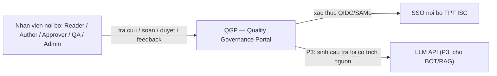
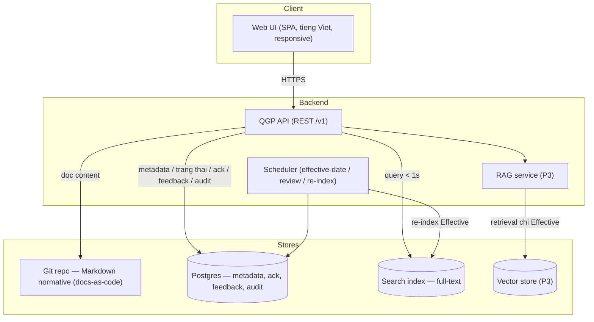
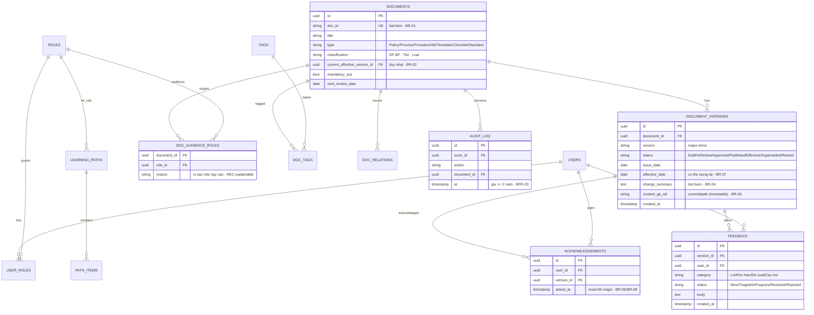
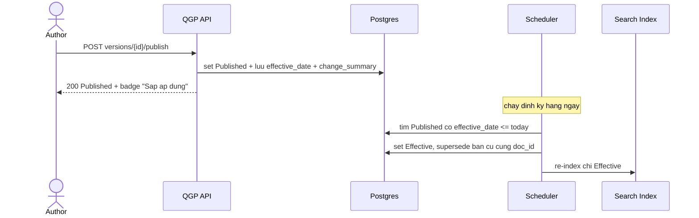
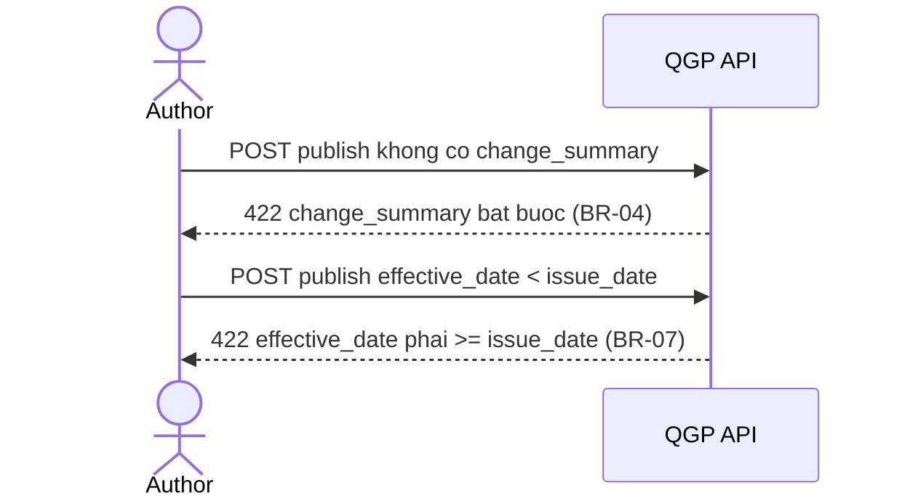
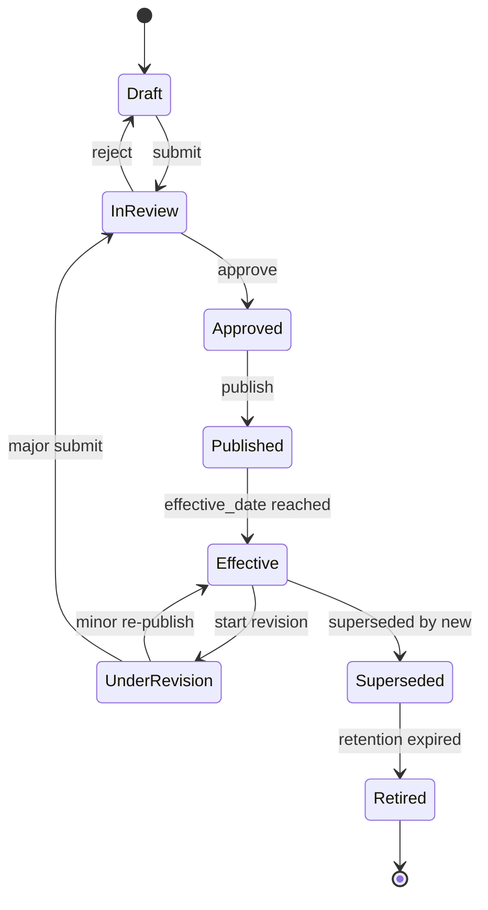
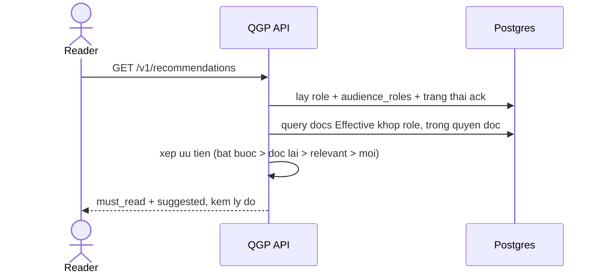

# Software Design Document (SDD) — Quality Governance Portal (QGP)

> **Khung SDD** map trực tiếp từ **PRD-QGP-001 v1.0 (Approved)**. Mọi mục kỹ thuật gắn tham chiếu ngược
> tới FR / UC / WF / BR / NFR của PRD. Ký hiệu `TODO(SA)` = điểm SA phải chốt chi tiết kỹ thuật.
>
> Định dạng: Markdown (thân thiện AI-agent) + biểu đồ **Mermaid** (C4 flowchart, erDiagram,
> stateDiagram-v2, sequenceDiagram). Node ID dùng ASCII, nhãn để trong ngoặc kép → render ổn định.

**SDD gồm 5 nhóm:** (A) Kiến trúc & Dữ liệu [1–2] · (B) API & Luồng [3–4] · (C) Chất lượng thuộc tính
[5–9] · (D) Vận hành & Rollout [10–13] · (E) Quyết định & Governance [14–18].

---

## 0. Document Information & History

### 0.1 Document Information

| Trường | Giá trị |
|---|---|
| Project | Quality Governance Portal (QGP) |
| Doc ID | SDD-QGP-001 |
| SDD version | 0.1 (Draft) |
| PRD nguồn | PRD-QGP-001 v1.0 (Approved) |
| Spec nguồn | PLAT-SPEC-QMS v0.1 |
| Engineering DRI (SA/TL) | [Chờ phân công] |
| Reviewers | TL, DevOps/SRE, CSOC, DBA, QC |
| Approver | SA Lead / PO |
| Created / Last updated | 2026-07-10 |
| Kiến trúc chốt | OD-1 — Docs-as-code (Git + static site generator + RAG) |

### 0.2 Document History

| Version | Date | Author | Change summary | Affects |
|---|---|---|---|---|
| 0.1 | 2026-07-10 | PhucDN7 | Khung SDD khởi tạo từ PRD v1.0 — kiến trúc, data model, API, flows, state machine, thuật toán REC & effective-transition, security, alternatives | All |

---

## 1. High-level Architecture

Kiến trúc hiện thực quyết định **OD-1: Docs-as-code** — nội dung normative lưu Markdown trong Git (nguồn
sự thật, bất biến theo commit — thỏa **BR-03, NFR-05, NFR-06**); metadata vòng đời / acknowledgement /
feedback / audit lưu DB quan hệ để truy vấn & báo cáo (RPT).

### 1.1 System context (C4 Level 1)



*(map: PRD §10.1 RBAC, ADM-F-05 SSO, BOT §9, NFR-04)*

### 1.2 Container view (C4 Level 2)



*(map: KB-F-03 search, WF-03 scheduler, DOC lifecycle, BOT-F-02/05)*

> **TODO(SA):** chốt công cụ cụ thể — static site generator (MkDocs vs Docusaurus), search engine
> (Meilisearch / OpenSearch / Postgres FTS), vector store (P3), framework API. Ràng buộc: host trên
> Ubuntu nội bộ (đang di trú Windows→Ubuntu), lean, open-source.

### 1.3 Component responsibilities

> Đặt tên service theo *ISC Internal Standard — Microservice Naming* (Appendix §17).

| Component | Responsibility | PRD map | Existing / New |
|---|---|---|---|
| Web UI | Tra cứu, soạn/duyệt, feedback in-context, panel "Tài liệu dành cho bạn" | DOC/KB/FBK/REC | New |
| QGP API | Vòng đời tài liệu, version/diff, ack, feedback, RBAC, recommendation | FR toàn bộ | New |
| Scheduler | Tự chuyển Effective + supersede, nhắc review, trigger re-index | WF-03, DOC-F-05/08 | New |
| Git repo | Lưu nội dung Markdown normative (bất biến theo commit) | BR-03, NFR-05/06 | New (hạ tầng có) |
| Postgres | Metadata, trạng thái, acknowledgement, feedback, audit log | RPT, ADM-F-03 | New |
| Search index | Full-text + filter tag/loại/phân hệ, < 1s | KB-F-03, NFR-02 | New |
| RAG service + Vector store | Q&A có trích nguồn, chỉ index Effective (P3) | BOT | New (P3) |
| SSO nội bộ | Xác thực OIDC/SAML | ADM-F-05, NFR-04 | Existing |

### 1.4 Key design choices

- **Nội dung Markdown-in-Git, metadata trong DB**: tách nội dung normative (bất biến, versioned bằng Git)
  khỏi trạng thái vận hành (truy vấn được) → thỏa đồng thời BR-03 (immutability) và RPT (báo cáo).
- **State machine + scheduler tách rời**: chuyển `Effective` do thời gian (WF-03) chạy nền, không phụ
  thuộc thao tác người → đảm bảo BR-02 (đúng 1 Effective) kể cả khi effective_date ở tương lai (BR-07).
- **Recommendation rules-based, explainable** (không ML ở P2): mọi gợi ý có lý do truy ngược được → BR-11.
- **BOT sau cùng (P3)**: chỉ bật khi corpus Effective đã sạch → tránh "rác vào rác ra".

---

## 2. Data Model

### 2.1 Entity diagram



*(map: PRD §4.3 metadata, DOC-F-01..12, REC-F-01, FBK, ONB, ADM-F-03)*

### 2.2 Schema (DDL)

> Đặt tên bảng/cột/index/constraint theo *ISC Internal Standard — Database Naming Convention* (Appendix §17).
> DDL dưới đây là **draft**, SA rà lại kiểu & ràng buộc.

```sql
CREATE TABLE documents (
  id                          UUID PRIMARY KEY DEFAULT gen_random_uuid(),
  doc_id                      TEXT NOT NULL UNIQUE,               -- BR-01 unique & immutable
  title                       TEXT NOT NULL,
  type                        TEXT NOT NULL,
  classification              TEXT,                               -- GF/BF . Tier . Loai
  mandatory_ack               BOOLEAN NOT NULL DEFAULT FALSE,
  next_review_date            DATE,
  current_effective_version_id UUID,                             -- BR-02: <= 1 Effective
  created_at                  TIMESTAMPTZ NOT NULL DEFAULT now()
);

CREATE TABLE document_versions (
  id              UUID PRIMARY KEY DEFAULT gen_random_uuid(),
  document_id     UUID NOT NULL REFERENCES documents(id),
  version         TEXT NOT NULL,                                  -- major.minor
  status          TEXT NOT NULL,                                  -- state machine (sec 4.3)
  issue_date      DATE,
  effective_date  DATE,                                           -- BR-07: >= issue_date
  change_summary  TEXT NOT NULL,                                  -- BR-04 mandatory
  content_git_ref TEXT NOT NULL,                                  -- BR-03 immutable content pointer
  created_at      TIMESTAMPTZ NOT NULL DEFAULT now(),
  UNIQUE (document_id, version)
);

-- BR-02: enforce at most one Effective version per doc_id
CREATE UNIQUE INDEX uq_one_effective_per_doc
  ON document_versions (document_id)
  WHERE status = 'Effective';

CREATE TABLE acknowledgements (
  id         UUID PRIMARY KEY DEFAULT gen_random_uuid(),
  user_id    UUID NOT NULL REFERENCES users(id),
  version_id UUID NOT NULL REFERENCES document_versions(id),
  acked_at   TIMESTAMPTZ NOT NULL DEFAULT now(),
  UNIQUE (user_id, version_id)
);

CREATE TABLE feedback (
  id         UUID PRIMARY KEY DEFAULT gen_random_uuid(),
  version_id UUID NOT NULL REFERENCES document_versions(id),
  user_id    UUID NOT NULL REFERENCES users(id),
  category   TEXT NOT NULL,
  status     TEXT NOT NULL DEFAULT 'New',
  body       TEXT,
  created_at TIMESTAMPTZ NOT NULL DEFAULT now()
);

CREATE TABLE doc_audience_roles (               -- REC-F-01
  document_id UUID NOT NULL REFERENCES documents(id),
  role_id     UUID NOT NULL REFERENCES roles(id),
  reason      TEXT,
  PRIMARY KEY (document_id, role_id)
);

CREATE TABLE audit_log (                        -- ADM-F-03, NFR-03 (>= 2 nam)
  id          UUID PRIMARY KEY DEFAULT gen_random_uuid(),
  actor_id    UUID REFERENCES users(id),
  action      TEXT NOT NULL,
  document_id UUID REFERENCES documents(id),
  detail      JSONB,
  at          TIMESTAMPTZ NOT NULL DEFAULT now()
);
```

> **TODO(SA):** DDL cho `users`, `roles`, `user_roles`, `tags`, `doc_tags`, `doc_relations`
> (supersedes/depends_on/impacts — DOC-F-07), `learning_paths`, `path_items` (ONB).

### 2.3 Indexes, partitioning, sharding

- `uq_one_effective_per_doc` (partial unique) — **enforce BR-02** ở tầng DB, không chỉ app.
- `documents(doc_id)` unique — BR-01.
- `document_versions(document_id, status)` — truy vấn bản Effective/lịch sử.
- `feedback(status, created_at)` — RPT-F-05 & triage.
- `audit_log(at)` — truy vấn theo thời gian; cân nhắc partition theo tháng (giữ ≥ 2 năm, NFR-03).
- Full-text: index tại **search engine** riêng (không dựa cột DB) — KB-F-03, NFR-02.

### 2.4 Data lifecycle

- **Retention**: `Retired` giữ theo policy compliance; audit_log ≥ 2 năm (**BR-09, NFR-03**).
- **Immutability**: bản `Published/Effective` không sửa — nội dung trỏ `content_git_ref` bất biến (**BR-03**).
- **Soft delete**: không hard-delete tài liệu — chuyển `Retired`, giữ truy vết (UC-12).
- **PII**: dữ liệu cá nhân chỉ ở `acknowledgements` (ai đọc gì) + `audit_log`. Metric truy cập tổng
  hợp aggregate, không per-user (**OD-3, BR-10**). Export tuân PRD §15 (PDPA/NĐ 13-2023).

---

## 3. API Design

> Request/response, đặt tên field, versioning, pagination, error code theo *ISC Internal Standard —
> API & Error Code* (Appendix §17). Base path `/v1`. Auth: Bearer (SSO). Mọi verb unsafe cần `Idempotency-Key`.

### 3.1 Endpoint summary

| Method | Path | Purpose | Auth (role tối thiểu) | PRD map |
|---|---|---|---|---|
| GET | /v1/documents | Danh sách/filter tài liệu | Reader | KB-F-03 |
| POST | /v1/documents | Tạo tài liệu (metadata) | Author | DOC-F-01, UC-01 |
| GET | /v1/documents/{doc_id} | Lấy bản Effective + badge trạng thái | Reader | DOC-F-12, UC-07/08 |
| GET | /v1/documents/{doc_id}/versions | Lịch sử phiên bản | Reader | DOC-F-06, UC-09 |
| GET | /v1/documents/{doc_id}/diff | Diff 2 version | Reader | DOC-F-06 |
| POST | /v1/documents/{doc_id}/versions | Tạo revision (minor/major) | Author | DOC-F-02, UC-05/06 |
| POST | /v1/versions/{id}/submit | Submit review | Author | DOC-F-04, UC-01 |
| POST | /v1/versions/{id}/approve | Approve/Reject | Approver | DOC-F-04, UC-02 |
| POST | /v1/versions/{id}/publish | Publish (issue/effective_date) | Author | DOC-F-03, UC-03 |
| POST | /v1/versions/{id}/acknowledge | Xác nhận đã đọc | Reader | DOC-F-09, UC-10 |
| GET | /v1/search | Full-text + filter | Reader | KB-F-03, NFR-02 |
| GET | /v1/recommendations | "Tài liệu dành cho bạn" theo role | Reader | REC-F-02, UC-23 |
| POST | /v1/feedback | Gửi feedback in-context | Reader | FBK-F-01, UC-15 |
| PATCH | /v1/feedback/{id} | Triage feedback | QA | FBK-F-03 |
| GET | /v1/reports/* | Báo cáo quản trị (aggregate) | QA Lead | RPT, UC-22 |
| GET | /v1/audit | Truy vết audit log | QA Lead/Auditor | ADM-F-03, UC-21 |
| POST | /v1/assistant/query | Hỏi–đáp BOT (P3) | Reader | BOT, UC-17/18 |

### 3.2 Detailed contracts (mẫu)

**POST /v1/versions/{id}/publish** — ban hành (map UC-03, DOC-F-03, BR-04/BR-07)

Request:
```http
POST /v1/versions/{id}/publish HTTP/1.1
Authorization: Bearer <jwt>
Idempotency-Key: <uuid>
Content-Type: application/json

{
  "issue_date": "2026-07-01",
  "effective_date": "2026-07-15",
  "change_summary": "Cap nhat tieu chi Quality Gate 1"
}
```
Response (200):
```json
{
  "version_id": "...",
  "doc_id": "QA-PROC-005",
  "version": "2.1",
  "status": "Published",
  "effective_date": "2026-07-15",
  "badge": "Sap ap dung tu 15/07/2026"
}
```
Error (một phần catalog): `422` thiếu `change_summary` (BR-04); `422` `effective_date < issue_date` (BR-07);
`409` version đã publish (BR-03); `403` sai role.

**GET /v1/recommendations** — gợi ý theo role (map UC-23, REC-F-02/03/04/05)

Response (200):
```json
{
  "must_read": [
    { "doc_id": "QA-POL-001", "version": "3.0", "reason": "bat buoc + vua len major",
      "effective_date": "2026-06-01" }
  ],
  "suggested": [
    { "doc_id": "QA-PROC-005", "version": "2.1", "reason": "khop role BA" }
  ]
}
```

### 3.3 Versioning strategy
URL path (`/v1`); breaking → `/v2` + `Sunset` header + parallel run; additive không bump. *(NFR)*

### 3.4 Idempotency
`Idempotency-Key` cho publish/approve/acknowledge/feedback; lưu Redis TTL 24h; same key+body → trả cache, khác body → `409`.

### 3.5 Pagination
Cursor-based (opaque token); page size default 50, max 200 — cho `/documents`, `/search`, `/feedback`, `/audit`.

---

## 4. Key Flows & State Machines

### 4.1 Happy path — Ban hành & tự động hiệu lực (WF-02 + WF-03)



*(map: UC-03, UC-04, BR-02, BR-07; NFR-05)*

### 4.2 Failure path — Chặn ban hành sai (BR-04/BR-07)



### 4.3 State machine — document_version.status (WF-01)



*(map: WF-01, DOC-F-05; invariants BR-02/BR-03/BR-05)*

### 4.4 Recommendation flow — gợi ý theo role (WF-07)



*(map: UC-23, REC-F-02..06, BR-11)*

---

## 5. Algorithms / Critical Business Logic

### 5.1 Chuyển Effective & supersede (scheduler — WF-03)

```text
each day:
  for v in versions where status = Published and effective_date <= today:
     tx:
        old = current Effective of v.document_id
        if old exists: old.status = Superseded
        v.status = Effective
        v.document.current_effective_version_id = v.id   # BR-02
        emit audit_log(action="auto_effective")
        enqueue reindex(v)                                # BOT-F-05, KB
```
Ràng buộc: partial unique index `uq_one_effective_per_doc` là "chốt chặn" cuối (BR-02).

### 5.2 Xếp ưu tiên gợi ý theo role (REC — explainable, BR-11)

```text
input: user (role_set), docs = Effective ∩ readable(user) ∩ audience_roles ∩ role_set
for d in docs:
  if d.mandatory_ack and not acked(user, d.effective_version): bucket = MUST_READ (reason="bat buoc")
  elif acked(user, older_major) and new_major(d):              bucket = MUST_READ (reason="can doc lai")
  else:                                                        bucket = SUGGESTED (reason="khop role" | "vua cap nhat")
sort MUST_READ trước SUGGESTED; trong nhóm: mới cập nhật trước
return {must_read, suggested} kèm reason  # explainable
```

### 5.3 Quy tắc version bump (BR-05)
`major (x.0)` = thay đổi normative → re-approval + reset acknowledgement (BR-08); `minor (x.y)` = editorial
→ owner tự phát hành, không reset. Loại thay đổi do Author khai báo, Approver xác nhận ở UC-06.

---

## 6. Security & Privacy

### 6.1 Authentication & authorization
SSO nội bộ (OIDC/SAML) — ADM-F-05, NFR-04. RBAC theo ma trận PRD §10.1:

| Resource / Action | Reader | Contributor | Author | Approver | QA Lead | Admin |
|---|:--:|:--:|:--:|:--:|:--:|:--:|
| Đọc tài liệu Effective | ✓ | ✓ | ✓ | ✓ | ✓ | ✓ |
| Đóng góp KB | – | ✓ | ✓ | ✓ | ✓ | ✓ |
| Soạn/sửa DOC | – | – | ✓ | ✓ | ✓ | – |
| Duyệt DOC | – | – | – | ✓ | ✓ | – |
| Quản trị hệ thống | – | – | – | – | ✓ (nghiệp vụ) | ✓ (kỹ thuật) |

### 6.2 Threat model (STRIDE)

| Threat | Vector | Mitigation |
|---|---|---|
| Spoofing | Giả danh người dùng | SSO, session ngắn hạn, không auth ngoài SSO |
| Tampering | Sửa bản đã ban hành | Immutable git ref + audit log (BR-03, ADM-F-03) |
| Repudiation | Chối thao tác | Audit log ai–gì–khi (NFR-03, ≥ 2 năm) |
| Information disclosure | Xem tài liệu ngoài quyền | RBAC tới cấp tài liệu; REC chỉ gợi ý trong quyền (BR-11) |
| DoS | Spam feedback/search | Rate limit; pagination cap |
| Elevation of privilege | Vượt quyền duyệt | Kiểm RBAC server-side theo RACI (ADM-F-06) |

### 6.3 Input validation
Validate metadata frontmatter (schema), category feedback (enum), sanitize Markdown render (chống XSS). *(TODO(SA): schema chi tiết)*

### 6.4 Secrets management
SSO client secret, LLM API key (P3) → secret manager nội bộ; không hardcode. *(TODO(SA))*

### 6.5 Privacy & data protection
PII tối thiểu (acknowledgement, audit). Metric truy cập **aggregate mặc định** (OD-3, BR-10). DPIA nhẹ theo PRD §15.

---

## 7. Performance & Capacity

| Metric | Target | Measured at |
|---|---|---|
| Search latency (p95) | < 1 s | Server-side, corpus vài nghìn tài liệu (NFR-02) |
| Page load (p95) | < 2 s | Mạng nội bộ |
| Availability | ≥ 99% | Giờ hành chính (NFR-01) |

- **Capacity**: vài nghìn tài liệu Markdown + lịch sử version (text, dung lượng nhỏ); concurrency mức nội bộ.
- **Caching**: bản Effective render (static) + kết quả search phổ biến; invalidation khi re-index (WF-03).
- **DB**: đọc nhiều hơn ghi; index theo §2.3.

> **TODO(SA):** con số concurrency/QPS cụ thể; chiến lược cache (CDN nội bộ / app cache).

---

## 8. Reliability & Failure Modes

| Failure | Detection | Impact | Mitigation | Recovery |
|---|---|---|---|---|
| Scheduler chết | Heartbeat/alert | Tài liệu không tự Effective đúng ngày | Idempotent job, chạy lại an toàn | Re-run; job quét lại theo ngày |
| Search index lỗi | Health check | Tra cứu chậm/lỗi | Fallback Postgres FTS tối thiểu | Rebuild index từ Git+DB |
| Git store unavailable | Health check | Không đọc/ghi nội dung | Read cache bản Effective | Khôi phục từ remote Git |
| LLM API down (P3) | Timeout | BOT không trả lời | BOT nói "không chắc" (BOT-F-04) | Retry/backoff |

Retry/timeout: mọi call ngoài (SSO, LLM, index) có timeout + backoff theo *ISC — API Timeout* (Appendix §17).

---

## 9. Observability

- **Logging**: structured JSON; correlation id theo request. Sự kiện vòng đời tài liệu ghi audit + log.
- **Tracing/metrics**: **OpenTelemetry** (NFR-07). RED (rate/errors/duration) cho API; USE cho tài nguyên.
- **Alerts**: scheduler fail, search p95 > 1s, error rate cao, BOT citation-rate < 100% (P3).
- **Product analytics events** (feed RPT):

| Event name | Trigger | Properties | Used to measure |
|---|---|---|---|
| doc_viewed | Mở tài liệu | doc_id, version, role (aggregate) | RPT-F-03 |
| doc_acknowledged | Xác nhận đọc | version_id, user | RPT-F-04 |
| feedback_submitted | Gửi feedback | category | RPT-F-05 |
| search_performed | Tìm kiếm | query_hash | RPT-F-03 |
| recommendation_shown | Mở panel gợi ý | count, buckets | REC hiệu quả |

*(OD-3: analytics ở mức aggregate)*

---

## 10. Testing & Verification

| Level | Scope | Target coverage | Owner |
|---|---|---|---|
| Unit | State machine, version bump, recommendation scoring | Logic BR-01..11 | Dev |
| Integration | API + DB + partial-unique (BR-02), scheduler | Luồng UC-01..24 | Dev/QC |
| E2E | Publish→Effective, ack reset major, feedback lifecycle, recommendation | AC-* | QC |
| NFR | Search < 1s, RBAC ngoài quyền, audit retention | NFR-02/03/04 | QC/SRE |

Mọi **AC** trong PRD §9.2 map thành test case `TC-*`; ma trận truy vết §10.1 PRD là nguồn để QC lập test plan.

---

## 11. Deployment & Rollout

- **Rollout theo phase PRD**: P1 (DOC+KB+FBK+ADM) → P2 (ONB+RPT+REC+review) → P3 (BOT).
- **Pipeline docs-as-code**: commit Markdown → CI (lint frontmatter/markdown, validate metadata & BR) →
  build static site → build search index → deploy Ubuntu nội bộ.
- **Feature flags**: bật/tắt REC, BOT theo phase; kill switch cho BOT.
- **Data migration**: import corpus hiện có (Excel/HTML/MD) → chuẩn hoá frontmatter → gán trạng thái/hiệu lực
  (A1 PRD: corpus được migrate & làm sạch trong P1).

> **TODO(SA):** chi tiết CI tool, môi trường (staging/prod), backfill script.

---

## 12. Backward Compatibility & Deprecation

| Surface | Old | New | Compat strategy | Deprecation |
|---|---|---|---|---|
| REST API | – | /v1 | Path versioning + Sunset header | Khi có /v2 |
| Doc format | Excel/HTML rời rạc | Markdown + frontmatter | Import 1 chiều, giữ bản gốc tham chiếu | Sau khi migrate xong P1 |

---

## 13. Operations & Runbook

- Job scheduler (effective/review/re-index): cách chạy lại thủ công, kiểm tra idempotent.
- Rebuild search index / vector store từ Git + DB.
- Khôi phục Git store; kiểm tra invariant BR-02 (script kiểm 1-Effective).
- Xử lý tài liệu quá hạn review (UC-11) & retire (UC-12).

> **TODO(SA/DevOps):** runbook chi tiết trước GA (bắt buộc theo PRD Appendix).

---

## 14. Alternatives Considered (Design Decisions)

### 14.1 Alternative A — Confluence/SharePoint + plugin (O2)
Ưu: nhanh, quen thuộc. Nhược: yếu ở phân biệt Approved≠Effective, kiểm soát ngày hiệu lực, AI-readable;
vendor lock-in. **Bị loại** (OD-1).

### 14.2 Alternative B — Custom app từ đầu (O3)
Ưu: toàn quyền tuỳ biến. Nhược: tốn nhất, over-engineering, time-to-market chậm. **Bị loại** (OD-1).

### 14.3 Build vs buy (technical lens)
**Chọn build-lean docs-as-code (O1)**: version bằng Git (bất biến, BR-03/NFR-05), export Markdown gốc
(NFR-06), corpus structured cho BOT. Chi phí: cần lớp UI cho non-dev thao tác thay vì Git trực tiếp (R5 PRD).

---

## 15. Glossary & Key Concepts

| Term | Meaning |
|---|---|
| Effective / Approved | Đang hiệu lực / đã duyệt nhưng có thể chưa tới ngày áp dụng (BR-07) |
| Superseded / Retired | Bị thay thế / hết vòng lưu trữ |
| docs-as-code | Quản lý tài liệu như mã nguồn (Git + generator tĩnh) |
| RAG | Retrieval-Augmented Generation — BOT trả lời dựa tài liệu + trích nguồn |
| RBAC | Role-Based Access Control |
| audience_roles | Vai trò áp dụng của tài liệu — nguồn cho gợi ý REC |
| BR-xx | Business Rule trong PRD §10.2 |

---

## 16. Design Sign-off

| Vai trò | Xác nhận | Bắt buộc khi |
|---|---|---|
| SA (DRI) | Thiết kế khả thi, map đúng PRD | Luôn |
| TL | Khả thi hiện thực | Luôn |
| DevOps/SRE | Hạ tầng Ubuntu, CI, observability | Trước GA |
| CSOC | Security/STRIDE | Có PII/regulatory |
| DBA | Data model, index, retention | Có schema/migration |

---

## 17. Appendix

- **PRD nguồn**: `product-spec/PRD_QGP_v1.0.docx` (PRD-QGP-001 v1.0, Approved)
- **Spec nguồn**: `product-spec/qms-governance-platform-spec.md` (PLAT-SPEC-QMS)
- **Internal Standards** (Appendix refs): Microservice Naming (§02), API Naming (§03), API Response & Error
  (§04), API Timeout (§05), DB Naming, Coding Convention (§06) — xem `docs/ai/internal_rules/`.
- Linked ADRs: OD-1..OD-5 (chuyển thành ADR trước khi build).

---

## 18. Phân công RACI theo mục (SDD)

| Mục SDD | BA | SA | PM | TL | Phê duyệt (A) | Hỗ trợ (R/C) |
|---|:--:|:--:|:--:|:--:|:--:|---|
| Architecture / Data / API / Flows | C | R | I | C | SA Lead/PO | DBA (C) |
| Security & Privacy | C | R | I | C | SA Lead/PO | CSOC (R) |
| Performance / Reliability / Observability | I | R | I | C | SA Lead/PO | DevOps (R) |
| Deployment / Rollout / Runbook | I | R | C | R | SA Lead/PO | DevOps (R) |
| Alternatives / Sign-off | C | R | C | C | SA Lead/PO | – |

---

*SDD-QGP-001 v0.1 (Draft) · khung khởi tạo map từ PRD-QGP-001 v1.0 · Markdown + Mermaid · Nội bộ FPT ISC*
