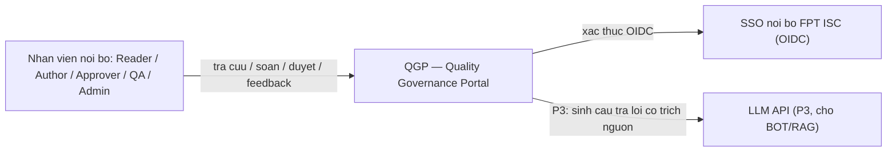
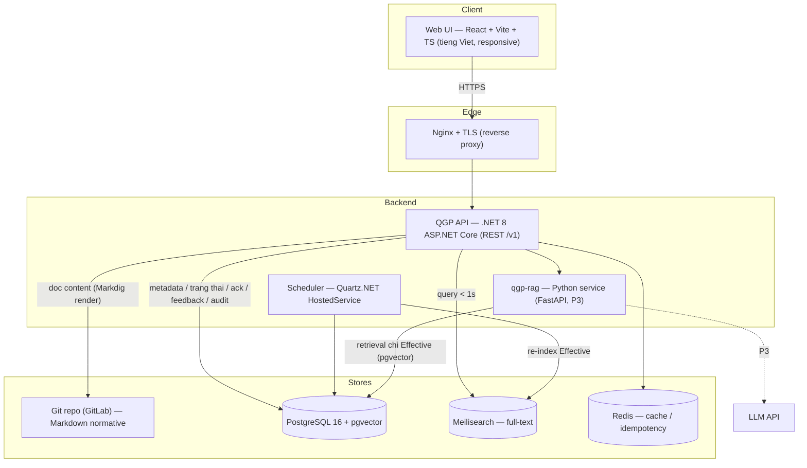
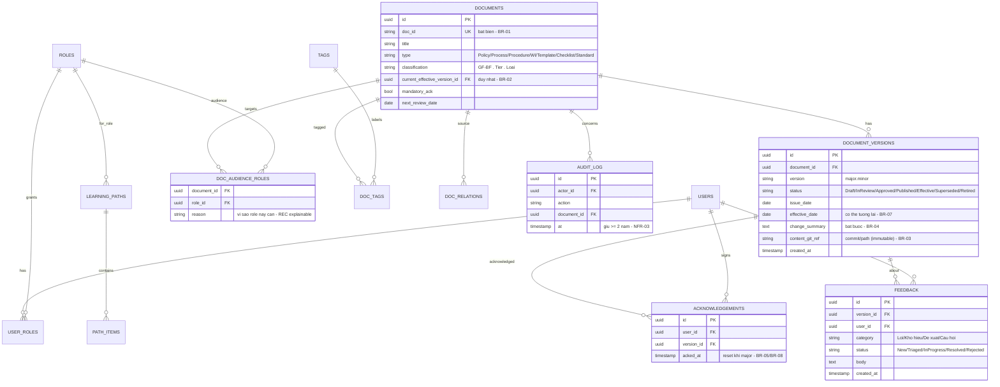
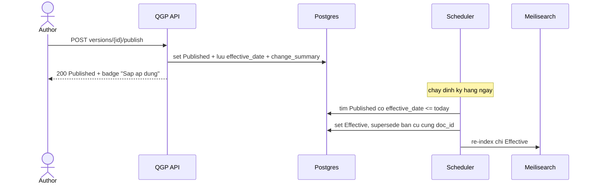
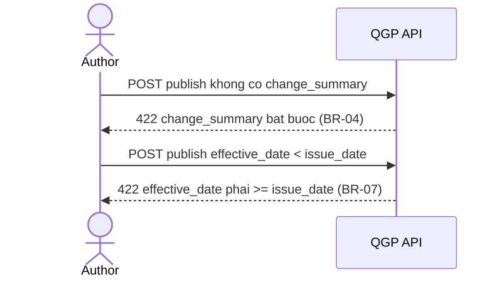
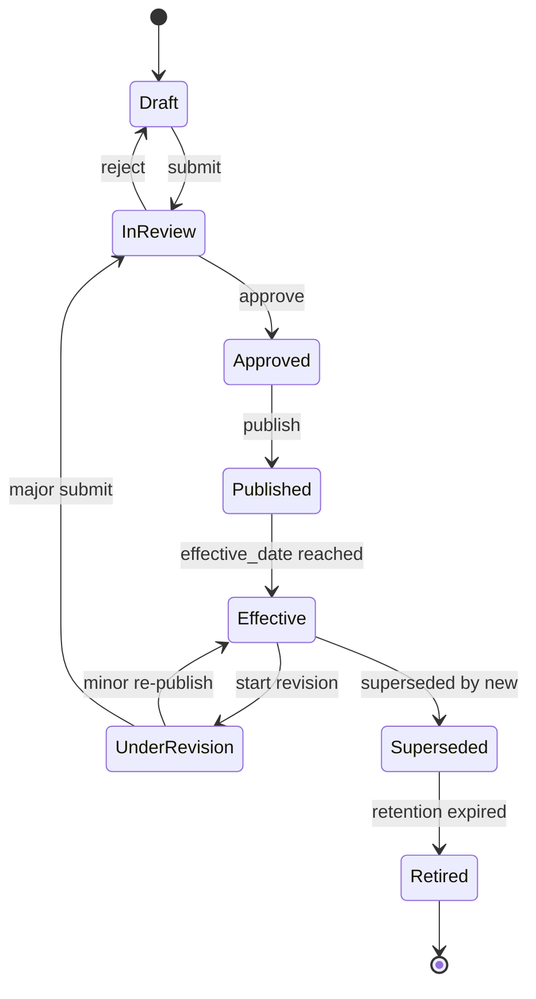
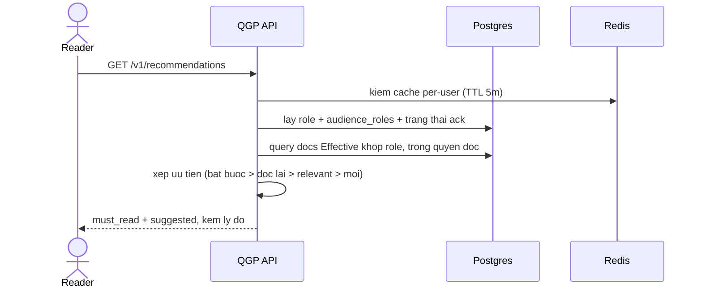

# Software Design Document (SDD) — Quality Governance Portal (QGP)

> **SDD v0.2** map trực tiếp từ **PRD-QGP-001 v1.0 (Approved)**. Mọi mục kỹ thuật gắn tham chiếu ngược
> tới FR / UC / WF / BR / NFR của PRD. **v0.2 đã chốt toàn bộ quyết định SA** (stack, DDL, validation,
> secrets, capacity, CI/CD, runbook) — xem §1.5.
>
> Định dạng: Markdown (thân thiện AI-agent) + biểu đồ **Mermaid** (đã validate render bằng mermaid-cli).
> Node ID ASCII, nhãn trong ngoặc kép → render ổn định trên GitHub/GitLab/VS Code/Confluence.

**SDD gồm 5 nhóm:** (A) Kiến trúc & Dữ liệu [1–2] · (B) API & Luồng [3–4] · (C) Chất lượng thuộc tính
[5–9] · (D) Vận hành & Rollout [10–13] · (E) Quyết định & Governance [14–18].

---

## 0. Document Information & History

### 0.1 Document Information

| Trường | Giá trị |
|---|---|
| Project | Quality Governance Portal (QGP) |
| Doc ID | SDD-QGP-001 |
| SDD version | 0.3 (Draft) |
| PRD nguồn | PRD-QGP-001 v1.0 (Approved) |
| Spec nguồn | PLAT-SPEC-QMS v0.1 |
| Engineering DRI (SA/TL) | [Chờ phân công] |
| Reviewers | TL, DevOps/SRE, CSOC, DBA, QC |
| Approver | SA Lead / PO |
| Created / Last updated | 2026-07-10 |
| Kiến trúc chốt | OD-1 docs-as-code; stack: .NET 8 + PostgreSQL 16 (+pgvector) + Meilisearch + React + GitLab CI — xem §1.5 |

### 0.2 Document History

| Version | Date | Author | Change summary | Affects |
|---|---|---|---|---|
| 0.1 | 2026-07-10 | PhucDN7 | Khung SDD khởi tạo từ PRD v1.0 — kiến trúc, data model, API, flows, state machine, thuật toán, security, alternatives | All |
| 0.2 | 2026-07-10 | PhucDN7 (SA) | Chốt toàn bộ TODO(SA): tech stack (§1.5), DDL đầy đủ (§2.2), input validation (§6.3), secrets (§6.4), capacity/caching (§7), CI/CD & backfill (§11), runbook (§13) | 1,2,6,7,11,13 |
| 0.3 | 2026-07-10 | PhucDN7 (SA) | RAG chuyển sang service Python riêng (hybrid .NET+Python, ADR-0007); liên kết bộ ADR-0001..0013 | 1,14 |

---

## 1. High-level Architecture

Kiến trúc hiện thực quyết định **OD-1: Docs-as-code** — nội dung normative lưu Markdown trong Git (nguồn
sự thật, bất biến theo commit — thỏa **BR-03, NFR-05, NFR-06**); metadata vòng đời / acknowledgement /
feedback / audit lưu DB quan hệ để truy vấn & báo cáo (RPT).

### 1.1 System context (C4 Level 1)



*(map: PRD §10.1 RBAC, ADM-F-05 SSO, BOT §9, NFR-04)*

### 1.2 Container view (C4 Level 2)



*(map: KB-F-03 search, WF-03 scheduler, DOC lifecycle, BOT-F-02/05)*

### 1.3 Component responsibilities

> Đặt tên service theo *ISC Internal Standard — Microservice Naming* (Appendix §17): `qgp-api`, `qgp-web`, `qgp-rag`.

| Component | Responsibility | PRD map | Existing / New |
|---|---|---|---|
| qgp-web (React) | Tra cứu, soạn/duyệt, feedback in-context, panel "Tài liệu dành cho bạn" | DOC/KB/FBK/REC | New |
| qgp-api (.NET 8) | Vòng đời tài liệu, version/diff, ack, feedback, RBAC, recommendation | FR toàn bộ | New |
| Scheduler (Quartz.NET) | Tự chuyển Effective + supersede, nhắc review, trigger re-index | WF-03, DOC-F-05/08 | New |
| Git repo (GitLab) | Lưu nội dung Markdown normative (bất biến theo commit) | BR-03, NFR-05/06 | New (hạ tầng có) |
| PostgreSQL 16 | Metadata, trạng thái, acknowledgement, feedback, audit log, vector (pgvector) | RPT, ADM-F-03 | New |
| Meilisearch | Full-text + filter tag/loại/phân hệ, < 1s, typo-tolerant tiếng Việt | KB-F-03, NFR-02 | New |
| Redis | Idempotency-Key, cache render/rec, session | §3.4, §7.3 | New |
| qgp-rag (Python: FastAPI + LlamaIndex) | Q&A có trích nguồn, chỉ index Effective (P3) | BOT | New (P3) |
| SSO nội bộ (OIDC) | Xác thực | ADM-F-05, NFR-04 | Existing |

### 1.4 Key design choices

- **Nội dung Markdown-in-Git, metadata trong DB**: tách nội dung normative (bất biến, versioned bằng Git)
  khỏi trạng thái vận hành (truy vấn được) → thỏa đồng thời BR-03 (immutability) và RPT (báo cáo).
- **Portal động, KHÔNG phải static site thuần**: MkDocs/Docusaurus (static) không làm được RBAC / workflow /
  badge trạng thái per-user / feedback / recommendation. Do đó QGP là **web app động** render Markdown từ
  Git server-side (Markdig); vẫn giữ trọn triết lý docs-as-code. Có thể export bản static read-only mirror
  cho tra cứu offline nếu cần.
- **State machine + scheduler tách rời**: chuyển `Effective` do thời gian (WF-03) chạy nền, không phụ
  thuộc thao tác người → đảm bảo BR-02 kể cả khi effective_date ở tương lai (BR-07).
- **pgvector thay vector store riêng**: dùng luôn Postgres cho embeddings (P3) → bớt 1 component, lean.
- **Recommendation rules-based, explainable** (không ML ở P2): mọi gợi ý có lý do truy ngược → BR-11.
- **BOT sau cùng (P3)**: chỉ bật khi corpus Effective đã sạch → tránh "rác vào rác ra".

### 1.5 Tech stack (chốt — SA decision)

Ràng buộc quyết định: nội bộ FPT ISC · lean (team 1–2 dev) · open-source · host Ubuntu · **hợp internal
standards** (Coding Convention ưu tiên .NET, engine SQL, MR/GitLab).

| Layer | Chọn | Lý do | Alternative đã cân nhắc |
|---|---|---|---|
| Frontend | **React 18 + Vite + TypeScript** | UX động (search, dashboard, panel gợi ý), responsive, tiếng Việt | Blazor (đơn stack), htmx server-render |
| Backend API | **.NET 8 ASP.NET Core (Minimal API)** | Hợp Coding Convention (.NET), cross-platform Ubuntu, hiệu năng | Python FastAPI, Node NestJS |
| Markdown render | **Markdig** (server-side) + HTML sanitizer | Render động kèm badge trạng thái/RBAC per-user | MkDocs/Docusaurus (static) |
| Content store | **Git (GitLab self-host)** | docs-as-code, bất biến theo commit (BR-03, NFR-05/06) | — |
| Database | **PostgreSQL 16** (+ `unaccent`, `pgcrypto`) | Quan hệ, partial-unique enforce BR-02, JSONB audit; hợp R-DECISION (SQL) | — |
| Vector store (P3) | **pgvector** (trong Postgres) | Không thêm component, lean | Qdrant, Milvus |
| Search | **Meilisearch** (single binary, Rust) | Full-text + typo-tolerant tiếng Việt, < 50 ms, nhẹ | Postgres FTS, OpenSearch |
| Cache / idempotency | **Redis 7** | Idempotency-Key (§3.4), cache render/rec, session | — |
| RAG / LLM (P3) | **Python service (FastAPI + LlamaIndex/LangChain)** gọi REST từ .NET (ADR-0007) | Ecosystem AI mạnh, tách vòng đời P3, scale/kill độc lập | Semantic Kernel (.NET đơn stack) |
| Auth | **OIDC** với IdP nội bộ | SSO, RBAC (ADM-F-05, NFR-04) | SAML |
| Scheduler | **Quartz.NET** trong HostedService | Job idempotent (effective/review/reindex) | cron OS + CLI |
| Reverse proxy | **Nginx** + TLS | Ubuntu nội bộ | Caddy |
| Đóng gói / deploy | **Docker + docker-compose** | Deploy Ubuntu, lean | Podman, k8s (quá mức) |
| CI/CD | **GitLab CI** | Hợp internal MR convention (`01_MR_Compliance`) | GitHub Actions |
| Observability | **OpenTelemetry** → Prometheus + Grafana + Loki + Tempo | NFR-07, self-host open-source | ELK |
| Secrets | **HashiCorp Vault** (prod) + GitLab masked vars (CI) + .NET Secret Manager (dev) | Open-source, Ubuntu | SOPS/age |

---

## 2. Data Model

### 2.1 Entity diagram



*(map: PRD §4.3 metadata, DOC-F-01..12, REC-F-01, FBK, ONB, ADM-F-03)*

### 2.2 Schema (DDL)

> Đặt tên bảng/cột/index/constraint theo *ISC Internal Standard — Database Naming Convention* (Appendix §17).
> Target: **PostgreSQL 16**, extension `pgcrypto` (gen_random_uuid), `unaccent` (search VN), `vector` (P3).

```sql
-- ===== Identity & RBAC =====
CREATE TABLE users (
  id          UUID PRIMARY KEY DEFAULT gen_random_uuid(),
  sso_subject TEXT NOT NULL UNIQUE,                 -- 'sub' claim OIDC
  email       TEXT,
  display_name TEXT,
  active      BOOLEAN NOT NULL DEFAULT TRUE,
  created_at  TIMESTAMPTZ NOT NULL DEFAULT now()
);

CREATE TABLE roles (
  id   UUID PRIMARY KEY DEFAULT gen_random_uuid(),
  code TEXT NOT NULL UNIQUE,                         -- reader/contributor/author/approver/qa_lead/admin
  name TEXT NOT NULL
);

CREATE TABLE user_roles (
  user_id UUID NOT NULL REFERENCES users(id),
  role_id UUID NOT NULL REFERENCES roles(id),
  PRIMARY KEY (user_id, role_id)
);

-- ===== Documents & versions =====
CREATE TABLE documents (
  id                           UUID PRIMARY KEY DEFAULT gen_random_uuid(),
  doc_id                       TEXT NOT NULL UNIQUE,        -- BR-01 unique & immutable
  title                        TEXT NOT NULL,
  type                         TEXT NOT NULL,
  classification               TEXT,
  mandatory_ack                BOOLEAN NOT NULL DEFAULT FALSE,
  next_review_date             DATE,
  current_effective_version_id UUID,                        -- BR-02
  created_at                   TIMESTAMPTZ NOT NULL DEFAULT now()
);

CREATE TABLE document_versions (
  id              UUID PRIMARY KEY DEFAULT gen_random_uuid(),
  document_id     UUID NOT NULL REFERENCES documents(id),
  version         TEXT NOT NULL,                            -- major.minor
  status          TEXT NOT NULL,                            -- state machine (sec 4.3)
  issue_date      DATE,
  effective_date  DATE,                                     -- BR-07: >= issue_date
  change_summary  TEXT NOT NULL,                            -- BR-04 mandatory
  content_git_ref TEXT NOT NULL,                            -- BR-03 immutable content pointer
  created_at      TIMESTAMPTZ NOT NULL DEFAULT now(),
  UNIQUE (document_id, version),
  CHECK (effective_date IS NULL OR issue_date IS NULL OR effective_date >= issue_date)  -- BR-07
);

-- BR-02: at most one Effective version per doc
CREATE UNIQUE INDEX uq_one_effective_per_doc
  ON document_versions (document_id) WHERE status = 'Effective';

-- DOC-F-07 relationships
CREATE TABLE doc_relations (
  id                 UUID PRIMARY KEY DEFAULT gen_random_uuid(),
  source_document_id UUID NOT NULL REFERENCES documents(id),
  target_document_id UUID NOT NULL REFERENCES documents(id),
  relation_type      TEXT NOT NULL CHECK (relation_type IN ('supersedes','depends_on','impacts')),
  UNIQUE (source_document_id, target_document_id, relation_type)
);

-- ===== Taxonomy =====
CREATE TABLE tags (
  id    UUID PRIMARY KEY DEFAULT gen_random_uuid(),
  slug  TEXT NOT NULL UNIQUE,
  label TEXT NOT NULL
);
CREATE TABLE doc_tags (
  document_id UUID NOT NULL REFERENCES documents(id),
  tag_id      UUID NOT NULL REFERENCES tags(id),
  PRIMARY KEY (document_id, tag_id)
);

-- ===== Compliance & recommendation =====
CREATE TABLE acknowledgements (
  id         UUID PRIMARY KEY DEFAULT gen_random_uuid(),
  user_id    UUID NOT NULL REFERENCES users(id),
  version_id UUID NOT NULL REFERENCES document_versions(id),
  acked_at   TIMESTAMPTZ NOT NULL DEFAULT now(),
  UNIQUE (user_id, version_id)
);

CREATE TABLE doc_audience_roles (              -- REC-F-01
  document_id UUID NOT NULL REFERENCES documents(id),
  role_id     UUID NOT NULL REFERENCES roles(id),
  reason      TEXT,
  PRIMARY KEY (document_id, role_id)
);

-- ===== Feedback =====
CREATE TABLE feedback (
  id         UUID PRIMARY KEY DEFAULT gen_random_uuid(),
  version_id UUID NOT NULL REFERENCES document_versions(id),
  user_id    UUID NOT NULL REFERENCES users(id),
  category   TEXT NOT NULL CHECK (category IN ('content_error','unclear','improvement','question')),
  status     TEXT NOT NULL DEFAULT 'New',
  body       TEXT,
  created_at TIMESTAMPTZ NOT NULL DEFAULT now()
);

-- ===== Onboarding (ONB) =====
CREATE TABLE learning_paths (
  id       UUID PRIMARY KEY DEFAULT gen_random_uuid(),
  role_id  UUID NOT NULL REFERENCES roles(id),
  title    TEXT NOT NULL,
  active   BOOLEAN NOT NULL DEFAULT TRUE
);
CREATE TABLE path_items (
  id               UUID PRIMARY KEY DEFAULT gen_random_uuid(),
  learning_path_id UUID NOT NULL REFERENCES learning_paths(id),
  document_id      UUID NOT NULL REFERENCES documents(id),
  seq              INT NOT NULL,
  mandatory        BOOLEAN NOT NULL DEFAULT FALSE,
  UNIQUE (learning_path_id, seq)
);

-- ===== Audit =====
CREATE TABLE audit_log (                       -- ADM-F-03, NFR-03 (>= 2 nam)
  id          UUID PRIMARY KEY DEFAULT gen_random_uuid(),
  actor_id    UUID REFERENCES users(id),
  action      TEXT NOT NULL,
  document_id UUID REFERENCES documents(id),
  detail      JSONB,
  at          TIMESTAMPTZ NOT NULL DEFAULT now()
) PARTITION BY RANGE (at);                      -- partition theo tháng
```

### 2.3 Indexes, partitioning, sharding

- `uq_one_effective_per_doc` (partial unique) — **enforce BR-02** ở tầng DB.
- `documents(doc_id)` unique — BR-01; CHECK effective_date >= issue_date — BR-07.
- `document_versions(document_id, status)`, `document_versions(status, effective_date)` — scheduler & lịch sử.
- `feedback(status, created_at)` — RPT-F-05 & triage.
- `audit_log` **partition theo tháng** (range on `at`); giữ ≥ 2 năm rồi drop partition cũ (NFR-03).
- `doc_audience_roles(role_id)` — REC query theo role.
- **Không sharding** (corpus vài nghìn tài liệu, một node Postgres dư sức); nếu tương lai lớn → partition audit/analytics trước.

### 2.4 Data lifecycle

- **Retention**: `Retired` giữ theo policy compliance; audit_log ≥ 2 năm (**BR-09, NFR-03**), rồi drop partition.
- **Immutability**: bản `Published/Effective` không sửa — `content_git_ref` bất biến (**BR-03**).
- **Soft delete**: không hard-delete tài liệu — chuyển `Retired`, giữ truy vết (UC-12).
- **PII**: chỉ ở `acknowledgements` + `audit_log`. Metric truy cập aggregate, không per-user (**OD-3, BR-10**).

---

## 3. API Design

> Request/response, đặt tên field, versioning, pagination, error code theo *ISC Internal Standard —
> API & Error Code* (Appendix §17). Base path `/v1`. Auth: Bearer (OIDC). Verb unsafe cần `Idempotency-Key`.

### 3.1 Endpoint summary

| Method | Path | Purpose | Auth (role tối thiểu) | PRD map |
|---|---|---|---|---|
| GET | /v1/documents | Danh sách/filter tài liệu | Reader | KB-F-03 |
| POST | /v1/documents | Tạo tài liệu (metadata) | Author | DOC-F-01, UC-01 |
| GET | /v1/documents/{doc_id} | Bản Effective + badge trạng thái | Reader | DOC-F-12, UC-07/08 |
| GET | /v1/documents/{doc_id}/versions | Lịch sử phiên bản | Reader | DOC-F-06, UC-09 |
| GET | /v1/documents/{doc_id}/diff | Diff 2 version | Reader | DOC-F-06 |
| POST | /v1/documents/{doc_id}/versions | Tạo revision (minor/major) | Author | DOC-F-02, UC-05/06 |
| POST | /v1/versions/{id}/submit | Submit review | Author | DOC-F-04, UC-01 |
| POST | /v1/versions/{id}/approve | Approve/Reject | Approver | DOC-F-04, UC-02 |
| POST | /v1/versions/{id}/publish | Publish (issue/effective_date) | Author | DOC-F-03, UC-03 |
| POST | /v1/versions/{id}/acknowledge | Xác nhận đã đọc | Reader | DOC-F-09, UC-10 |
| GET | /v1/search | Full-text + filter | Reader | KB-F-03, NFR-02 |
| GET | /v1/recommendations | "Tài liệu dành cho bạn" theo role | Reader | REC-F-02, UC-23 |
| POST | /v1/feedback | Gửi feedback in-context | Reader | FBK-F-01, UC-15 |
| PATCH | /v1/feedback/{id} | Triage feedback | QA | FBK-F-03 |
| GET | /v1/reports/* | Báo cáo quản trị (aggregate) | QA Lead | RPT, UC-22 |
| GET | /v1/audit | Truy vết audit log | QA Lead/Auditor | ADM-F-03, UC-21 |
| POST | /v1/assistant/query | Hỏi–đáp BOT (P3) | Reader | BOT, UC-17/18 |

### 3.2 Detailed contracts (mẫu)

**POST /v1/versions/{id}/publish** — ban hành (map UC-03, DOC-F-03, BR-04/BR-07)

```http
POST /v1/versions/{id}/publish HTTP/1.1
Authorization: Bearer <jwt>
Idempotency-Key: <uuid>
Content-Type: application/json

{ "issue_date": "2026-07-01", "effective_date": "2026-07-15",
  "change_summary": "Cap nhat tieu chi Quality Gate 1" }
```
Response (200):
```json
{ "version_id": "...", "doc_id": "QA-PROC-005", "version": "2.1",
  "status": "Published", "effective_date": "2026-07-15", "badge": "Sap ap dung tu 15/07/2026" }
```
Error: `422` thiếu `change_summary` (BR-04); `422` `effective_date < issue_date` (BR-07);
`409` version đã publish (BR-03); `403` sai role.

**GET /v1/recommendations** — gợi ý theo role (map UC-23, REC-F-02/03/04/05)

```json
{ "must_read": [ { "doc_id": "QA-POL-001", "version": "3.0",
    "reason": "bat buoc + vua len major", "effective_date": "2026-06-01" } ],
  "suggested": [ { "doc_id": "QA-PROC-005", "version": "2.1", "reason": "khop role BA" } ] }
```

### 3.3 Versioning strategy
URL path (`/v1`); breaking → `/v2` + `Sunset` header + parallel run; additive không bump.

### 3.4 Idempotency
`Idempotency-Key` cho publish/approve/acknowledge/feedback; lưu **Redis** TTL 24h; same key+body → cache, khác body → `409`.

### 3.5 Pagination
Cursor-based (opaque token); page size default 50, max 200.

---

## 4. Key Flows & State Machines

### 4.1 Happy path — Ban hành & tự động hiệu lực (WF-02 + WF-03)



*(map: UC-03, UC-04, BR-02, BR-07; NFR-05)*

### 4.2 Failure path — Chặn ban hành sai (BR-04/BR-07)



### 4.3 State machine — document_version.status (WF-01)



*(map: WF-01, DOC-F-05; invariants BR-02/BR-03/BR-05)*

### 4.4 Recommendation flow — gợi ý theo role (WF-07)



*(map: UC-23, REC-F-02..06, BR-11)*

---

## 5. Algorithms / Critical Business Logic

### 5.1 Chuyển Effective & supersede (scheduler — WF-03)

```text
each day (Quartz.NET job, idempotent):
  for v in versions where status = Published and effective_date <= today:
     tx:
        old = current Effective of v.document_id
        if old exists: old.status = Superseded
        v.status = Effective
        v.document.current_effective_version_id = v.id   # BR-02
        emit audit_log(action="auto_effective")
        enqueue reindex(v)                                # BOT-F-05, KB
```
Chốt chặn cuối: partial unique index `uq_one_effective_per_doc` (BR-02).

### 5.2 Xếp ưu tiên gợi ý theo role (REC — explainable, BR-11)

```text
input: user (role_set), docs = Effective ∩ readable(user) ∩ audience_roles ∩ role_set
for d in docs:
  if d.mandatory_ack and not acked(user, d.effective_version): bucket = MUST_READ (reason="bat buoc")
  elif acked(user, older_major) and new_major(d):              bucket = MUST_READ (reason="can doc lai")
  else:                                                        bucket = SUGGESTED (reason="khop role" | "vua cap nhat")
sort MUST_READ trước SUGGESTED; trong nhóm: mới cập nhật trước
cache per-user TTL 5m; invalidate khi có Effective/major/ack moi
return {must_read, suggested} kèm reason
```

### 5.3 Quy tắc version bump (BR-05)
`major (x.0)` = normative → re-approval + reset acknowledgement (BR-08); `minor (x.y)` = editorial → owner
tự phát hành, không reset. Loại thay đổi do Author khai báo, Approver xác nhận (UC-06).

---

## 6. Security & Privacy

### 6.1 Authentication & authorization
SSO nội bộ (OIDC) — ADM-F-05, NFR-04. RBAC theo ma trận PRD §10.1, enforce server-side:

| Resource / Action | Reader | Contributor | Author | Approver | QA Lead | Admin |
|---|:--:|:--:|:--:|:--:|:--:|:--:|
| Đọc tài liệu Effective | ✓ | ✓ | ✓ | ✓ | ✓ | ✓ |
| Đóng góp KB | – | ✓ | ✓ | ✓ | ✓ | ✓ |
| Soạn/sửa DOC | – | – | ✓ | ✓ | ✓ | – |
| Duyệt DOC | – | – | – | ✓ | ✓ | – |
| Quản trị hệ thống | – | – | – | – | ✓ (nghiệp vụ) | ✓ (kỹ thuật) |

### 6.2 Threat model (STRIDE)

| Threat | Vector | Mitigation |
|---|---|---|
| Spoofing | Giả danh người dùng | OIDC, session ngắn hạn, không auth ngoài SSO |
| Tampering | Sửa bản đã ban hành | Immutable git ref + audit log (BR-03, ADM-F-03) |
| Repudiation | Chối thao tác | Audit log ai–gì–khi (NFR-03, ≥ 2 năm) |
| Information disclosure | Xem/gợi ý tài liệu ngoài quyền | RBAC tới cấp tài liệu; REC lọc theo quyền (BR-11) |
| DoS | Spam feedback/search | Rate limit (Nginx + API), pagination cap |
| Elevation of privilege | Vượt quyền duyệt | Kiểm RBAC server-side theo RACI (ADM-F-06) |

### 6.3 Input validation
Enforce ở API bằng **FluentValidation** + validate frontmatter Markdown ở CI (fail pipeline nếu sai).

**Document metadata (frontmatter) schema:**

| Field | Rule |
|---|---|
| `doc_id` | required, regex `^[A-Z]{2,}-[A-Z]{2,}-\d{3,}$` (vd `QA-PROC-005`), **immutable** (BR-01) |
| `title` | required, 1–200 ký tự |
| `type` | enum: Policy/Process/Procedure/Work Instruction/Template/Checklist/Standard |
| `version` | regex `^\d+\.\d+$` |
| `status` | enum theo state machine §4.3 |
| `issue_date`,`effective_date` | ISO-8601 date; `effective_date >= issue_date` (BR-07) |
| `change_summary` | required khi publish, 1–500 ký tự (BR-04) |
| `classification` | pattern `(GF\|BF)\s*·\s*Tier-\d\s*·\s*\w+` |
| `mandatory_ack` | boolean |
| `audience_roles` | array các role code hợp lệ (REC-F-01) |

**Feedback:** `category` ∈ {content_error, unclear, improvement, question}; `body` optional ≤ 2000; context
(doc_id/version/url) **server-attached**, không nhận từ client (FBK-F-04, chống giả mạo).

**Render**: Markdig + HTML sanitizer (whitelist) → chống XSS khi hiển thị Markdown.

### 6.4 Secrets management
- **Prod**: HashiCorp Vault — chứa OIDC client secret, LLM API key (P3), DB credentials, Meilisearch master
  key, Redis password. App đọc qua Vault agent / env injection lúc khởi động.
- **CI**: GitLab CI *masked + protected variables*; không log secret.
- **Dev**: .NET Secret Manager / `.env` (gitignored). Không commit secret vào Git (khớp hook `post-write-check`
  chặn hardcoded secret).
- **Rotation**: theo policy nội bộ; ưu tiên short-lived credentials cho DB (Vault dynamic secrets nếu khả thi).

### 6.5 Privacy & data protection
PII tối thiểu (acknowledgement, audit). Metric truy cập **aggregate mặc định** (OD-3, BR-10). DPIA nhẹ theo PRD §15 (PDPA/NĐ 13-2023).

---

## 7. Performance & Capacity

### 7.1 Performance budget

| Metric | Target | Measured at |
|---|---|---|
| Search latency (p95) | < 1 s (Meilisearch mục tiêu < 100 ms) | Server-side, corpus vài nghìn tài liệu (NFR-02) |
| API read (p95) | < 300 ms | Server-side |
| Page load (p95) | < 2 s | Mạng nội bộ |
| Availability | ≥ 99% | Giờ hành chính (NFR-01) |

### 7.2 Capacity plan

> Giả định (cần validate với QA/PMO): tổ chức nội bộ, dùng giờ hành chính.

| Chỉ số | Ước tính | Ghi chú |
|---|---|---|
| Users at launch | 300–500 (Reader) | Author/Approver ~30–50 |
| Peak concurrency | 50–100 | Giờ cao điểm nội bộ |
| API peak throughput | ~50 rps | Đọc là chủ yếu |
| Search peak | ~10 rps | Meilisearch dư sức |
| Corpus | 2,000–5,000 tài liệu | Markdown + lịch sử, ~50–200 MB |
| Growth 12 tháng | +30–50% | Theo số role onboard |

**Sizing khởi điểm** (docker-compose 1 host Ubuntu): `qgp-api` 2 vCPU/4 GB (×1, scale ngang khi cần) ·
Postgres 2 vCPU/4 GB · Meilisearch 1 vCPU/1 GB · Redis 0.5 vCPU/512 MB · Nginx nhẹ. Headroom lớn; nghẽn
đầu tiên (nếu có) là render/search → thêm instance `qgp-api` sau Nginx.

### 7.3 Caching strategy

| Cache | Key | TTL | Invalidation | Store |
|---|---|---|---|---|
| Rendered Effective doc (HTML) | doc_id + version | 1h | Khi đổi trạng thái / re-index (WF-03) | Redis + in-mem |
| Search results phổ biến | query hash + filter | 60s | Tự hết hạn | Redis |
| Recommendations per-user | user_id | 5m | Khi có Effective/major/ack mới | Redis |
| Idempotency-Key | key | 24h | Tự hết hạn (§3.4) | Redis |

### 7.4 Database considerations
Đọc >> ghi; index theo §2.3; connection pool (Npgsql); partition `audit_log` theo tháng; `unaccent` cho tra cứu phụ trợ.

---

## 8. Reliability & Failure Modes

| Failure | Detection | Impact | Mitigation | Recovery |
|---|---|---|---|---|
| Scheduler chết | Heartbeat/alert | Tài liệu không tự Effective đúng ngày | Job idempotent, chạy lại an toàn | Re-run; quét lại theo ngày |
| Meilisearch lỗi | Health check | Tra cứu chậm/lỗi | Fallback Postgres FTS tối thiểu | Rebuild index từ Git+DB |
| Git store unavailable | Health check | Không đọc/ghi nội dung | Read cache bản Effective (Redis) | Khôi phục từ remote Git |
| Postgres down | Health check | Ngừng ghi trạng thái | HA/replica (tùy hạ tầng) | Restore từ backup |
| LLM API down (P3) | Timeout | BOT không trả lời | BOT nói "không chắc" (BOT-F-04) | Retry/backoff |

Retry/timeout: mọi call ngoài (SSO, LLM, index) có timeout + backoff theo *ISC — API Timeout* (Appendix §17); circuit breaker (Polly) cho LLM/Meilisearch.

---

## 9. Observability

- **Logging**: structured JSON (Serilog); correlation id per request; sự kiện vòng đời ghi audit + log.
- **Tracing/metrics**: **OpenTelemetry** (NFR-07) → OTLP → Prometheus (metrics) + Tempo (trace) + Loki (log) + Grafana. RED cho API; USE cho tài nguyên.
- **Alerts**: scheduler fail, search p95 > 1s, error rate cao, Postgres/Meili down, BOT citation-rate < 100% (P3).
- **Product analytics events** (feed RPT, aggregate — OD-3):

| Event name | Trigger | Properties | Used to measure |
|---|---|---|---|
| doc_viewed | Mở tài liệu | doc_id, version, role (aggregate) | RPT-F-03 |
| doc_acknowledged | Xác nhận đọc | version_id, user | RPT-F-04 |
| feedback_submitted | Gửi feedback | category | RPT-F-05 |
| search_performed | Tìm kiếm | query_hash | RPT-F-03 |
| recommendation_shown | Mở panel gợi ý | count, buckets | REC hiệu quả |

---

## 10. Testing & Verification

| Level | Scope | Target coverage | Owner |
|---|---|---|---|
| Unit | State machine, version bump, recommendation scoring, validators | Logic BR-01..11 | Dev |
| Integration | API + DB + partial-unique (BR-02), scheduler (Testcontainers Postgres/Meili) | Luồng UC-01..24 | Dev/QC |
| E2E | Publish→Effective, ack reset major, feedback lifecycle, recommendation | AC-* | QC |
| NFR | Search < 1s, RBAC ngoài quyền, audit retention | NFR-02/03/04 | QC/SRE |

Mọi **AC** trong PRD §9.2 → test case `TC-*`; ma trận truy vết §10.1 PRD là nguồn để QC lập test plan.

---

## 11. Deployment & Rollout

- **Rollout theo phase PRD**: P1 (DOC+KB+FBK+ADM) → P2 (ONB+RPT+REC+review) → P3 (BOT).

### 11.1 Rollout stages

| Stage | Audience | Entry criteria | Exit criteria |
|---|---|---|---|
| Dev | Team | Build pass | Unit/integration xanh |
| Staging | QA + pilot roles | E2E pass, corpus mẫu | UAT đạt, NFR đo được |
| Prod (P1) | Toàn tổ chức | Corpus P1 migrate xong (A1) | G1 (100% Effective) tiến triển |

### 11.2 Build & deploy pipeline (GitLab CI)

```yaml
stages: [validate, build, test, package, deploy]
validate:   # markdownlint + frontmatter schema + BR lint (change_summary, effective>=issue, single-Effective check)
build:      # dotnet publish (qgp-api) + npm build (qgp-web)
test:       # dotnet test (unit + integration Testcontainers) + web tests
package:    # docker build + push registry noi bo
deploy:     # docker-compose up staging -> smoke test -> (MR merged, manual approve) -> prod
```
- **Feature flags**: bật/tắt REC, BOT theo phase (config); **kill switch** cho BOT.
- **MR compliance**: theo `docs/ai/internal_rules/01_MR_Compliance.md` (Conventional Commits, tag [AI] nếu AI sinh).

### 11.3 Feature flag & kill switch
Config-driven (appsettings + env): `feature.rec`, `feature.bot`, `bot.killSwitch`. Mặc định P1: REC off, BOT off.

### 11.4 Data migration & backfill

Script idempotent, chạy được lại từng tài liệu (A1 PRD — corpus migrate & làm sạch trong P1):

1. **Inventory**: liệt kê tài liệu hiện có (Excel/HTML/Markdown/ổ chia sẻ).
2. **Convert**: → Markdown + frontmatter (bán tự động; QA rà metadata thủ công).
3. **Assign**: `doc_id`, `version=1.0`, `status`, `issue_date`/`effective_date`, `classification`, `audience_roles`.
4. **Load**: commit Markdown vào Git; seed rows `documents`/`document_versions`; build Meilisearch index.
5. **Verify**: chạy script kiểm invariant BR-02 (1 Effective/doc), kiểm link & transclusion.

---

## 12. Backward Compatibility & Deprecation

| Surface | Old | New | Compat strategy | Deprecation |
|---|---|---|---|---|
| REST API | – | /v1 | Path versioning + Sunset header | Khi có /v2 |
| Doc format | Excel/HTML rời rạc | Markdown + frontmatter | Import 1 chiều, giữ bản gốc tham chiếu | Sau khi migrate xong P1 |

---

## 13. Operations & Runbook

**RB-01 — Chạy lại scheduler job thủ công**: trigger endpoint admin `/v1/admin/jobs/effective-transition:run`
(chỉ Admin) hoặc CLI; job idempotent nên an toàn chạy lại; kiểm audit_log `action=auto_effective`.

**RB-02 — Rebuild Meilisearch index**: `qgp-api` admin task đọc bản Effective từ Git+DB → re-push toàn bộ;
dùng khi index lỗi/lệch. Không ảnh hưởng dữ liệu nguồn.

**RB-03 — Kiểm invariant BR-02** (1 Effective/doc):
```sql
SELECT document_id, count(*) FROM document_versions
WHERE status='Effective' GROUP BY document_id HAVING count(*) > 1;   -- phải rỗng
```

**RB-04 — Rotate secrets**: cập nhật trong Vault → restart rolling `qgp-api`; verify health `/healthz`.

**RB-05 — Khôi phục**: Git (clone lại từ remote GitLab) · Postgres (restore backup PITR) · Meilisearch (RB-02) · Redis (cache, tự warm lại).

**RB-06 — Tài liệu quá hạn review (UC-11)/retire (UC-12)**: xem báo cáo RPT-F-02; owner cập nhật hoặc QA
khởi tạo retire (đổi `Retired`, không hard-delete).

**RB-07 — Kill switch BOT (P3)**: đặt `bot.killSwitch=true` → API trả 503 cho `/v1/assistant/*`, không ảnh hưởng DOC/KB.

> Runbook đầy đủ (on-call, escalation) hoàn thiện trước GA — bắt buộc theo PRD Appendix.

---

## 14. Alternatives Considered (Design Decisions)

### 14.1 Alternative A — Confluence/SharePoint + plugin (O2)
Nhanh, quen thuộc nhưng yếu ở Approved≠Effective, kiểm soát ngày hiệu lực, AI-readable; vendor lock-in. **Bị loại** (OD-1).

### 14.2 Alternative B — Custom app từ đầu / static site thuần (O3 & MkDocs)
Static generator (MkDocs/Docusaurus) không làm được RBAC/workflow/feedback/rec per-user. Custom-from-scratch
tốn nhất. **Chọn trung dung**: docs-as-code (Git) + web app động lean (.NET).

### 14.3 Build vs buy (technical lens)
**Chọn build-lean docs-as-code (O1)**: version bằng Git (BR-03/NFR-05), export Markdown gốc (NFR-06), corpus
structured cho BOT. Chi phí: cần lớp UI cho non-dev thay vì Git trực tiếp (R5 PRD).

### 14.4 Stack alternatives (SA rationale)
- **.NET + Python hybrid (ADR-0006, ADR-0007)**: core backend .NET (hợp Coding Convention, Ubuntu); RAG là
  service Python riêng (FastAPI + LlamaIndex) — tận dụng ecosystem AI, tách vòng đời P3, gọi qua REST nội bộ.
- **Meilisearch vs Postgres FTS**: chọn Meilisearch cho typo-tolerance & tiếng Việt tốt, vẫn nhẹ; Postgres FTS làm fallback.
- **pgvector vs vector DB riêng**: chọn pgvector để bớt component (lean).

---

## 15. Glossary & Key Concepts

| Term | Meaning |
|---|---|
| Effective / Approved | Đang hiệu lực / đã duyệt nhưng có thể chưa tới ngày áp dụng (BR-07) |
| Superseded / Retired | Bị thay thế / hết vòng lưu trữ |
| docs-as-code | Quản lý tài liệu như mã nguồn (Git + render động) |
| RAG | Retrieval-Augmented Generation — BOT trả lời dựa tài liệu + trích nguồn |
| RBAC | Role-Based Access Control |
| audience_roles | Vai trò áp dụng của tài liệu — nguồn cho gợi ý REC |
| pgvector | Extension Postgres lưu & tìm vector embeddings |
| BR-xx | Business Rule trong PRD §10.2 |

---

## 16. Design Sign-off

| Vai trò | Xác nhận | Bắt buộc khi |
|---|---|---|
| SA (DRI) | Thiết kế khả thi, map đúng PRD | Luôn |
| TL | Khả thi hiện thực | Luôn |
| DevOps/SRE | Hạ tầng Ubuntu, CI, observability | Trước GA |
| CSOC | Security/STRIDE | Có PII/regulatory |
| DBA | Data model, index, retention | Có schema/migration |

---

## 17. Appendix

- **PRD nguồn**: `product-spec/PRD_QGP_v1.0.docx` (PRD-QGP-001 v1.0, Approved)
- **Spec nguồn**: `product-spec/qms-governance-platform-spec.md` (PLAT-SPEC-QMS)
- **Internal Standards**: Microservice Naming (§02), API Naming (§03), API Response & Error (§04),
  API Timeout (§05), Coding Convention (§06), MR Compliance (§01) — xem `docs/ai/internal_rules/`.
- Linked ADRs: `product-spec/adr/` (ADR-0001..0013) — OD-1..5 + quyết định stack; xem `adr/README.md`.

---

## 18. Phân công RACI theo mục (SDD)

| Mục SDD | BA | SA | PM | TL | Phê duyệt (A) | Hỗ trợ (R/C) |
|---|:--:|:--:|:--:|:--:|:--:|---|
| Architecture / Data / API / Flows | C | R | I | C | SA Lead/PO | DBA (C) |
| Security & Privacy | C | R | I | C | SA Lead/PO | CSOC (R) |
| Performance / Reliability / Observability | I | R | I | C | SA Lead/PO | DevOps (R) |
| Deployment / Rollout / Runbook | I | R | C | R | SA Lead/PO | DevOps (R) |
| Alternatives / Sign-off | C | R | C | C | SA Lead/PO | – |

---

*SDD-QGP-001 v0.3 (Draft) · RAG=Python service (hybrid) · ADR-0001..0013 · map từ PRD v1.0 · Markdown + Mermaid · Nội bộ FPT ISC*
