# Software Design Document (SDD) — Quality Governance Portal (QGP)

> **SDD v1.0** — bản đầy đủ, map từ **PRD-QGP-001 v1.0 (Approved)** và bộ **ADR-0001..0013**.
> Mỗi diagram có **ảnh SVG render sẵn** (hiện ngay trong VS Code/mọi viewer) + **source Mermaid** trong
> `<details>` để chỉnh sửa. Mọi mục kỹ thuật gắn tham chiếu ngược PRD (FR/UC/WF/BR/NFR) và ADR.

**5 nhóm:** (A) Kiến trúc & Dữ liệu [1–2] · (B) API & Luồng [3–4] · (C) Chất lượng thuộc tính [5–9] ·
(D) Vận hành & Rollout [10–13] · (E) Quyết định & Governance [14–18].

---

## 0. Document Information & History

### 0.1 Document Information

| Trường | Giá trị |
|---|---|
| Project | Quality Governance Portal (QGP) |
| Doc ID | SDD-QGP-001 |
| SDD version | 1.0 (In Review) |
| PRD nguồn | PRD-QGP-001 v1.0 (Approved) |
| ADR | ADR-0001..0013 (`product-spec/adr/`) |
| API contract | `product-spec/api/openapi.yaml`, `qgp-rag.openapi.yaml` |
| Engineering DRI (SA/TL) | [Chờ phân công] |
| Reviewers | TL, DevOps/SRE, CSOC, DBA, QC |
| Approver | SA Lead / PO |
| Created / Last updated | 2026-07-10 |

### 0.2 Document History

| Version | Date | Author | Change summary | Affects |
|---|---|---|---|---|
| 0.1 | 2026-07-10 | PhucDN7 | Khung SDD từ PRD | All |
| 0.2 | 2026-07-10 | PhucDN7 (SA) | Chốt tech stack, DDL, validation, secrets, capacity, CI/CD, runbook | 1,2,6,7,11,13 |
| 0.3 | 2026-07-10 | PhucDN7 (SA) | RAG = service Python (ADR-0007), liên kết ADR | 1,14 |
| 1.0 | 2026-07-10 | PhucDN7 (SA) | Bản đầy đủ: HLV + C4 L1/L2/L3 + deployment + data flow + 6 sequence; đào sâu data/API/security/reliability/observability/testing; error catalog, data classification, RPO/RTO; render ảnh nhúng | All |

---

## 1. High-level Architecture

### 1.0 High-Level View (HLV)

Bức tranh tổng thể: người dùng nội bộ tương tác qua Web UI; lõi `qgp-api` phục vụ 8 nhóm năng lực
(DOC/KB/ONB/RPT/FBK/ADM/REC/BOT); nội dung normative nằm trong Git; trạng thái/metadata trong Postgres;
tra cứu qua Meilisearch; RAG (P3) là service Python riêng.



<details><summary>Mermaid source</summary>

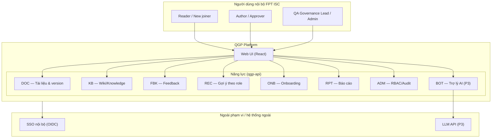
```mermaid
flowchart TB
  subgraph Users["Người dùng nội bộ FPT ISC"]
    R["Reader / New joiner"]
    A["Author / Approver"]
    Q["QA Governance Lead / Admin"]
  end
  subgraph QGP["QGP Platform"]
    UI["Web UI (React)"]
    subgraph CAP["Năng lực (qgp-api)"]
      DOC["DOC — Tài liệu & version"]
      KB["KB — Wiki/Knowledge"]
      FBK["FBK — Feedback"]
      REC["REC — Gợi ý theo role"]
      ONB["ONB — Onboarding"]
      RPT["RPT — Báo cáo"]
      ADM["ADM — RBAC/Audit"]
      BOT["BOT — Trợ lý AI (P3)"]
    end
  end
  subgraph EXT["Ngoài phạm vi / hệ thống ngoài"]
    SSO["SSO nội bộ (OIDC)"]
    LLM["LLM API (P3)"]
  end
  R --> UI
  A --> UI
  Q --> UI
  UI --> DOC
  UI --> KB
  UI --> FBK
  UI --> REC
  UI --> ONB
  UI --> RPT
  UI --> ADM
  UI --> BOT
  QGP --> SSO
  BOT --> LLM
```

</details>

### 1.1 System context (C4 Level 1)

Ai dùng hệ thống, hệ thống nói chuyện với gì bên ngoài, qua giao thức nào.



<details><summary>Mermaid source</summary>

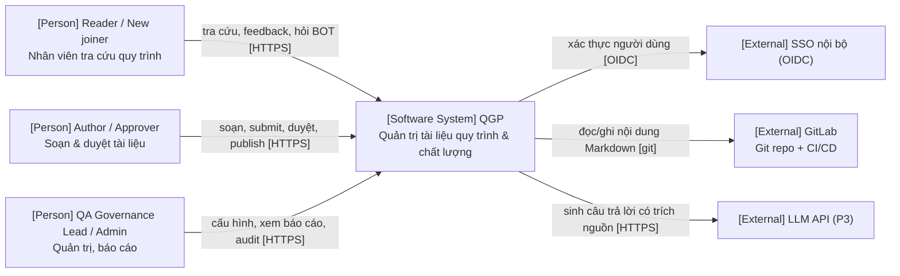
```mermaid
flowchart LR
  person_reader["[Person] Reader / New joiner<br/>Nhân viên tra cứu quy trình"]
  person_author["[Person] Author / Approver<br/>Soạn & duyệt tài liệu"]
  person_qa["[Person] QA Governance Lead / Admin<br/>Quản trị, báo cáo"]
  sys_qgp["[Software System] QGP<br/>Quản trị tài liệu quy trình & chất lượng"]
  sys_sso["[External] SSO nội bộ (OIDC)"]
  sys_git["[External] GitLab<br/>Git repo + CI/CD"]
  sys_llm["[External] LLM API (P3)"]

  person_reader -->|"tra cứu, feedback, hỏi BOT [HTTPS]"| sys_qgp
  person_author -->|"soạn, submit, duyệt, publish [HTTPS]"| sys_qgp
  person_qa -->|"cấu hình, xem báo cáo, audit [HTTPS]"| sys_qgp
  sys_qgp -->|"xác thực người dùng [OIDC]"| sys_sso
  sys_qgp -->|"đọc/ghi nội dung Markdown [git]"| sys_git
  sys_qgp -->|"sinh câu trả lời có trích nguồn [HTTPS]"| sys_llm
```

</details>

### 1.2 Container view (C4 Level 2)

Các container (đơn vị triển khai độc lập) + công nghệ + giao thức.



<details><summary>Mermaid source</summary>

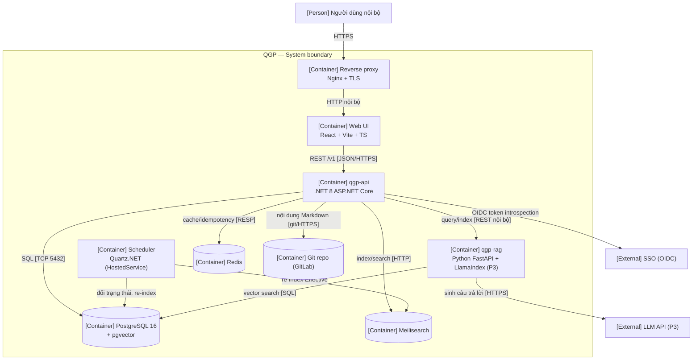
```mermaid
flowchart TB
  person["[Person] Người dùng nội bộ"]
  subgraph boundary["QGP — System boundary"]
    web["[Container] Web UI<br/>React + Vite + TS"]
    nginx["[Container] Reverse proxy<br/>Nginx + TLS"]
    api["[Container] qgp-api<br/>.NET 8 ASP.NET Core"]
    sch["[Container] Scheduler<br/>Quartz.NET (HostedService)"]
    rag["[Container] qgp-rag<br/>Python FastAPI + LlamaIndex (P3)"]
    db[("[Container] PostgreSQL 16<br/>+ pgvector")]
    idx[("[Container] Meilisearch")]
    cache[("[Container] Redis")]
    git[("[Container] Git repo (GitLab)")]
  end
  sso["[External] SSO (OIDC)"]
  llm["[External] LLM API (P3)"]

  person -->|"HTTPS"| nginx
  nginx -->|"HTTP nội bộ"| web
  web -->|"REST /v1 [JSON/HTTPS]"| api
  api -->|"OIDC token introspection"| sso
  api -->|"nội dung Markdown [git/HTTPS]"| git
  api -->|"SQL [TCP 5432]"| db
  api -->|"index/search [HTTP]"| idx
  api -->|"cache/idempotency [RESP]"| cache
  api -->|"query/index [REST nội bộ]"| rag
  sch -->|"đổi trạng thái, re-index"| db
  sch -->|"re-index Effective"| idx
  rag -->|"vector search [SQL]"| db
  rag -->|"sinh câu trả lời [HTTPS]"| llm
```

</details>

### 1.3 Component view (C4 Level 3 — bên trong qgp-api)



<details><summary>Mermaid source</summary>

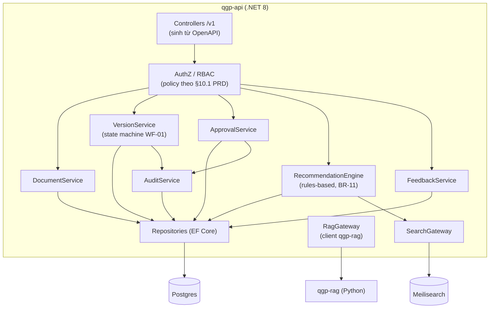
```mermaid
flowchart TB
  subgraph api["qgp-api (.NET 8)"]
    ctl["Controllers /v1<br/>(sinh từ OpenAPI)"]
    authz["AuthZ / RBAC<br/>(policy theo §10.1 PRD)"]
    docsvc["DocumentService"]
    versvc["VersionService<br/>(state machine WF-01)"]
    appsvc["ApprovalService"]
    recsvc["RecommendationEngine<br/>(rules-based, BR-11)"]
    fbksvc["FeedbackService"]
    searchgw["SearchGateway"]
    raggw["RagGateway<br/>(client qgp-rag)"]
    audit["AuditService"]
    repo["Repositories (EF Core)"]
  end
  db[("Postgres")]
  idx[("Meilisearch")]
  rag["qgp-rag (Python)"]

  ctl --> authz
  authz --> docsvc
  authz --> versvc
  authz --> appsvc
  authz --> recsvc
  authz --> fbksvc
  docsvc --> repo
  versvc --> repo
  appsvc --> repo
  recsvc --> repo
  fbksvc --> repo
  versvc --> audit
  appsvc --> audit
  recsvc --> searchgw
  searchgw --> idx
  raggw --> rag
  repo --> db
  audit --> repo
```

</details>

### 1.4 Key design choices
- **Markdown-in-Git + metadata-in-DB**: nội dung normative bất biến theo commit (BR-03/NFR-05/06); trạng
  thái vận hành truy vấn được cho RPT. (ADR-0001)
- **Web app động, không static site**: static generator không làm được RBAC/workflow/badge per-user. (ADR-0001)
- **State machine + scheduler tách rời**: chuyển `Effective` theo thời gian, độc lập thao tác người (BR-02/07).
- **Recommendation rules-based, explainable** (BR-11); **RAG service Python riêng** (ADR-0007); **pgvector**
  làm vector store dùng chung (ADR-0008).

### 1.5 Deployment (Ubuntu / docker-compose)



<details><summary>Mermaid source</summary>

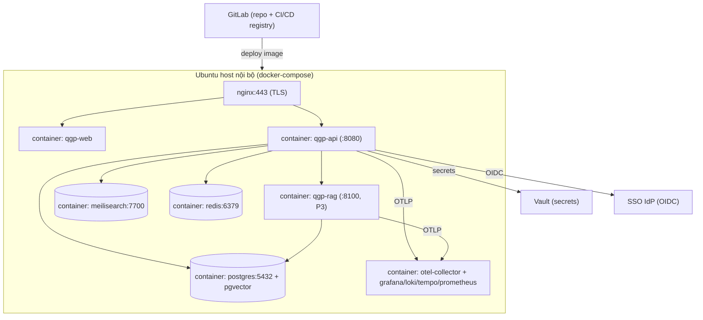
```mermaid
flowchart TB
  subgraph host["Ubuntu host nội bộ (docker-compose)"]
    ngx["nginx:443 (TLS)"]
    cweb["container: qgp-web"]
    capi["container: qgp-api (:8080)"]
    crag["container: qgp-rag (:8100, P3)"]
    cpg[("container: postgres:5432 + pgvector")]
    cidx[("container: meilisearch:7700")]
    credis[("container: redis:6379")]
    cotel["container: otel-collector + grafana/loki/tempo/prometheus"]
  end
  vault["Vault (secrets)"]
  gitlab["GitLab (repo + CI/CD registry)"]
  idp["SSO IdP (OIDC)"]

  ngx --> cweb
  ngx --> capi
  capi --> cpg
  capi --> cidx
  capi --> credis
  capi --> crag
  crag --> cpg
  capi -->|"secrets"| vault
  capi -->|"OIDC"| idp
  gitlab -->|"deploy image"| host
  capi -->|"OTLP"| cotel
  crag -->|"OTLP"| cotel
```

</details>

Chi tiết stack: xem §1.6. RPO/RTO: §8.4.

### 1.6 Tech stack (chốt)

| Layer | Chọn | ADR |
|---|---|---|
| Frontend | React 18 + Vite + TS | ADR-0010 |
| Backend | .NET 8 ASP.NET Core + EF Core + FluentValidation + Serilog + Polly + Quartz.NET | ADR-0006 |
| Content store | Git (GitLab) — Markdown + frontmatter | ADR-0001 |
| Database | PostgreSQL 16 (+ pgvector, unaccent) | ADR-0008 |
| Search | Meilisearch | ADR-0009 |
| Cache | Redis 7 | — |
| RAG (P3) | Python FastAPI + LlamaIndex, gọi REST từ .NET | ADR-0007 |
| Auth | OIDC (SSO nội bộ) | — |
| CI/CD | GitLab CI + Docker + Nginx | ADR-0011 |
| Secrets | HashiCorp Vault | ADR-0012 |
| Observability | OpenTelemetry + Prometheus/Grafana/Loki/Tempo | ADR-0013 |

---

## 2. Data Model

### 2.1 Entity diagram (ERD)



<details><summary>Mermaid source</summary>

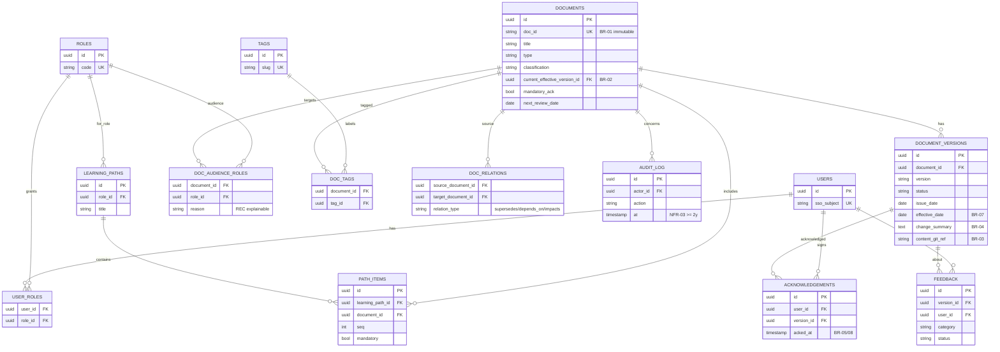
```mermaid
erDiagram
  USERS ||--o{ USER_ROLES : has
  ROLES ||--o{ USER_ROLES : grants
  DOCUMENTS ||--o{ DOCUMENT_VERSIONS : has
  DOCUMENTS ||--o{ DOC_AUDIENCE_ROLES : targets
  ROLES ||--o{ DOC_AUDIENCE_ROLES : audience
  DOCUMENTS ||--o{ DOC_TAGS : tagged
  TAGS ||--o{ DOC_TAGS : labels
  DOCUMENTS ||--o{ DOC_RELATIONS : source
  DOCUMENT_VERSIONS ||--o{ ACKNOWLEDGEMENTS : acknowledged
  USERS ||--o{ ACKNOWLEDGEMENTS : signs
  DOCUMENT_VERSIONS ||--o{ FEEDBACK : about
  USERS ||--o{ FEEDBACK : submits
  DOCUMENTS ||--o{ AUDIT_LOG : concerns
  ROLES ||--o{ LEARNING_PATHS : for_role
  LEARNING_PATHS ||--o{ PATH_ITEMS : contains
  DOCUMENTS ||--o{ PATH_ITEMS : includes

  DOCUMENTS {
    uuid id PK
    string doc_id UK "BR-01 immutable"
    string title
    string type
    string classification
    uuid current_effective_version_id FK "BR-02"
    bool mandatory_ack
    date next_review_date
  }
  DOCUMENT_VERSIONS {
    uuid id PK
    uuid document_id FK
    string version
    string status
    date issue_date
    date effective_date "BR-07"
    text change_summary "BR-04"
    string content_git_ref "BR-03"
  }
  ACKNOWLEDGEMENTS {
    uuid id PK
    uuid user_id FK
    uuid version_id FK
    timestamp acked_at "BR-05/08"
  }
  FEEDBACK {
    uuid id PK
    uuid version_id FK
    uuid user_id FK
    string category
    string status
  }
  DOC_AUDIENCE_ROLES {
    uuid document_id FK
    uuid role_id FK
    string reason "REC explainable"
  }
  DOC_RELATIONS {
    uuid source_document_id FK
    uuid target_document_id FK
    string relation_type "supersedes/depends_on/impacts"
  }
  AUDIT_LOG {
    uuid id PK
    uuid actor_id FK
    string action
    timestamp at "NFR-03 >= 2y"
  }
  LEARNING_PATHS {
    uuid id PK
    uuid role_id FK
    string title
  }
  PATH_ITEMS {
    uuid id PK
    uuid learning_path_id FK
    uuid document_id FK
    int seq
    bool mandatory
  }
  USERS { uuid id PK
    string sso_subject UK }
  ROLES { uuid id PK
    string code UK }
  TAGS { uuid id PK
    string slug UK }
  USER_ROLES { uuid user_id FK
    uuid role_id FK }
  DOC_TAGS { uuid document_id FK
    uuid tag_id FK }
```

</details>

### 2.2 Data dictionary (trọng yếu)

| Entity | Mục đích | Ghi chú governance |
|---|---|---|
| documents | Danh tính tài liệu (doc_id ổn định) | BR-01 unique+immutable; trỏ bản Effective hiện hành (BR-02) |
| document_versions | Từng phiên bản + trạng thái vòng đời | Nội dung ở Git (`content_git_ref`), immutable (BR-03) |
| acknowledgements | Bằng chứng đã đọc tài liệu bắt buộc | reset khi major (BR-05/08); per-user (nghĩa vụ, OD-3) |
| feedback | Phản hồi in-context + vòng đời | category enum; context server-attached (FBK-F-04) |
| doc_audience_roles | Role áp dụng của tài liệu | nguồn cho REC + reason explainable (BR-11) |
| doc_relations | supersedes/depends_on/impacts | cảnh báo tác động (DOC-F-07) |
| audit_log | Truy vết bất biến | partition tháng, giữ ≥ 2 năm (NFR-03) |

### 2.3 Schema (DDL)
DDL đầy đủ 12 bảng + partial-unique enforce BR-02 + CHECK BR-07 + partition audit theo tháng: xem
`product-spec/api/` chưa chứa DDL; DDL canonical giữ tại repo `db/migrations/` (EF Core migrations).
Trích yếu ràng buộc:

```sql
-- BR-02: đúng 1 bản Effective mỗi doc
CREATE UNIQUE INDEX uq_one_effective_per_doc
  ON document_versions (document_id) WHERE status = 'Effective';
-- BR-07: effective_date >= issue_date
ALTER TABLE document_versions
  ADD CONSTRAINT ck_effective_ge_issue
  CHECK (effective_date IS NULL OR issue_date IS NULL OR effective_date >= issue_date);
-- BR-01: doc_id duy nhất
ALTER TABLE documents ADD CONSTRAINT uq_doc_id UNIQUE (doc_id);
```

### 2.4 Indexes / partitioning
- `uq_one_effective_per_doc` (partial unique) — chốt chặn BR-02 tại DB.
- `document_versions(status, effective_date)` — scheduler quét Published tới hạn.
- `feedback(status, created_at)` — triage + RPT-F-05.
- `doc_audience_roles(role_id)` — REC theo role.
- `audit_log` PARTITION BY RANGE(at) theo tháng; drop partition > 24 tháng.
- Full-text: Meilisearch (không dựa cột DB).

### 2.5 Data lifecycle
- Retention: Retired giữ theo compliance; audit ≥ 2 năm (BR-09/NFR-03).
- Immutability: bản Published/Effective bất biến (BR-03).
- Soft delete: không hard-delete, chuyển Retired (UC-12).
- PII: chỉ ở acknowledgements + audit; metric truy cập aggregate (OD-3/BR-10). Data classification §6.6.

---

## 3. API Design

Public API `/v1` (OpenAPI 3.1: `product-spec/api/openapi.yaml`, đã validate Redocly 0 lỗi). Contract nội
bộ qgp-rag: `qgp-rag.openapi.yaml`. Đặt tên field/error theo *ISC — API & Error Code*.

### 3.1 Conventions
- **Auth**: Bearer OIDC. **Idempotency**: header `Idempotency-Key` (uuid) cho mọi verb unsafe, lưu Redis TTL 24h.
- **Pagination**: cursor-based (`cursor`, `limit` default 50/max 200), response `{ data, next_cursor }`.
- **Versioning**: URL path `/v1`; breaking → `/v2` + `Sunset` header + parallel run; additive không bump.
- **Error envelope**: `{ error: { code, message, details? } }`.

### 3.2 Endpoint summary (18 endpoint)

| operationId | Method Path | PRD |
|---|---|---|
| listDocuments | GET /documents | KB-F-03 |
| createDocument | POST /documents | DOC-F-01 |
| getDocument | GET /documents/{doc_id} | DOC-F-12 |
| listVersions / createVersion | GET/POST /documents/{doc_id}/versions | DOC-F-02/06 |
| getDiff | GET /documents/{doc_id}/diff | DOC-F-06 |
| submitVersion / approveVersion / publishVersion / acknowledgeVersion | POST /versions/{id}/... | DOC-F-04/03/09 |
| search | GET /search | KB-F-03 |
| getRecommendations | GET /recommendations | REC-F-02 |
| createFeedback / triageFeedback | POST /feedback, PATCH /feedback/{id} | FBK |
| getIssuanceReport / getComplianceReport | GET /reports/* | RPT |
| listAudit | GET /audit | ADM-F-03 |
| askAssistant | POST /assistant/query | BOT |

### 3.3 Error code catalog (trích)

| HTTP | code | Khi nào | Rule |
|---|---|---|---|
| 422 | DOC_CHANGE_SUMMARY_REQUIRED | Publish thiếu change_summary | BR-04 |
| 422 | DOC_EFFECTIVE_BEFORE_ISSUE | effective_date < issue_date | BR-07 |
| 409 | DOC_ID_DUPLICATE | Trùng doc_id | BR-01 |
| 409 | VERSION_IMMUTABLE | Sửa bản đã publish | BR-03 |
| 409 | INVALID_STATE_TRANSITION | Chuyển trạng thái sai state machine | WF-01 |
| 403 | RBAC_FORBIDDEN | Thao tác ngoài quyền | §10.1 |
| 503 | ASSISTANT_UNAVAILABLE | BOT tắt / qgp-rag down | kill switch |

### 3.4 Detailed contracts
Xem `openapi.yaml` cho request/response schema đầy đủ (publish, recommendations, assistant/query có example).
Ví dụ `publishVersion` trả `409 VERSION_IMMUTABLE` (BR-03), `422` cho BR-04/BR-07.

---

## 4. Key Flows & State Machines

### 4.1 State machine — document_version.status (WF-01)



<details><summary>Mermaid source</summary>

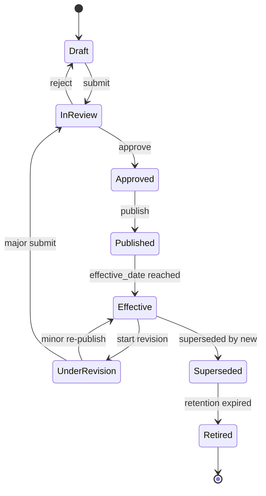
```mermaid
stateDiagram-v2
  [*] --> Draft
  Draft --> InReview: submit
  InReview --> Approved: approve
  InReview --> Draft: reject
  Approved --> Published: publish
  Published --> Effective: effective_date reached
  Effective --> UnderRevision: start revision
  UnderRevision --> Effective: minor re-publish
  UnderRevision --> InReview: major submit
  Effective --> Superseded: superseded by new
  Superseded --> Retired: retention expired
  Retired --> [*]
```

</details>

### 4.2 Feedback lifecycle (WF-04)



<details><summary>Mermaid source</summary>

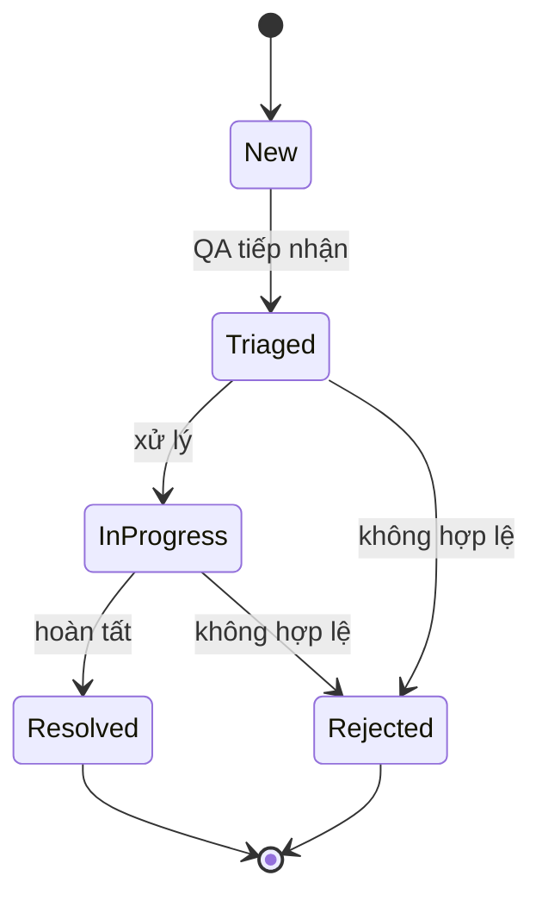
```mermaid
stateDiagram-v2
  [*] --> New
  New --> Triaged: QA tiếp nhận
  Triaged --> InProgress: xử lý
  InProgress --> Resolved: hoàn tất
  Triaged --> Rejected: không hợp lệ
  InProgress --> Rejected: không hợp lệ
  Resolved --> [*]
  Rejected --> [*]
```

</details>

### 4.3 Sequence — Publish & tự động hiệu lực (WF-02 + WF-03)

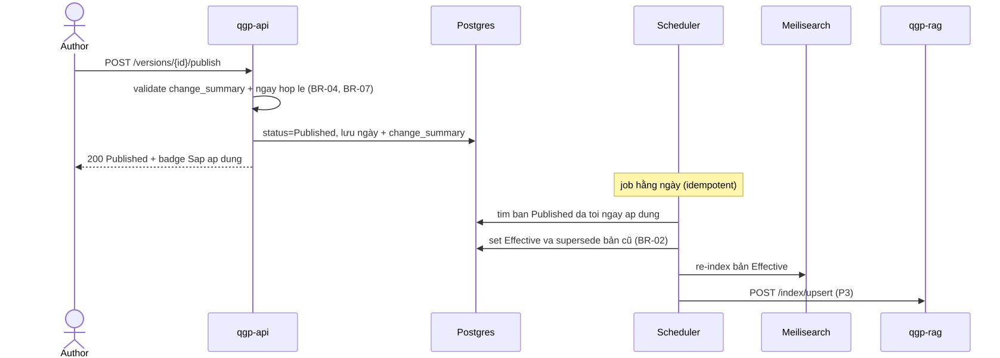

<details><summary>Mermaid source</summary>

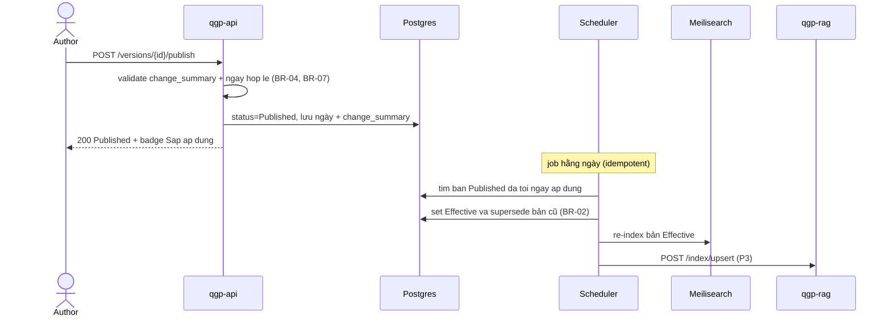
```mermaid
sequenceDiagram
  actor A as Author
  participant API as qgp-api
  participant DB as Postgres
  participant SCH as Scheduler
  participant IDX as Meilisearch
  participant RAG as qgp-rag
  A->>API: POST /versions/{id}/publish
  API->>API: validate change_summary + ngay hop le (BR-04, BR-07)
  API->>DB: status=Published, lưu ngày + change_summary
  API-->>A: 200 Published + badge Sap ap dung
  Note over SCH: job hằng ngày (idempotent)
  SCH->>DB: tim ban Published da toi ngay ap dung
  SCH->>DB: set Effective va supersede bản cũ (BR-02)
  SCH->>IDX: re-index bản Effective
  SCH->>RAG: POST /index/upsert (P3)
```

</details>

### 4.4 Sequence — Major revision + reset acknowledgement (UC-06)

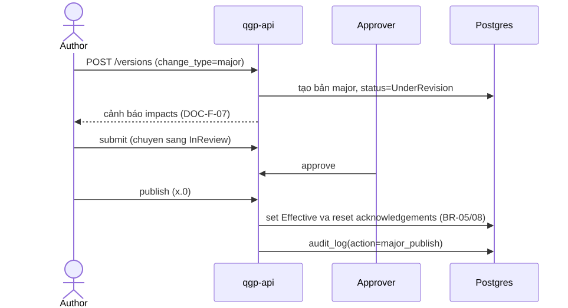

<details><summary>Mermaid source</summary>

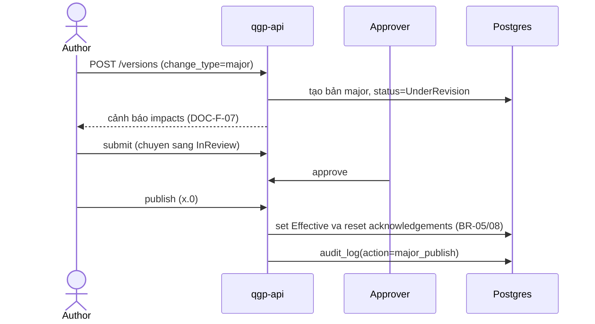
```mermaid
sequenceDiagram
  actor A as Author
  participant API as qgp-api
  participant AP as Approver
  participant DB as Postgres
  A->>API: POST /versions (change_type=major)
  API->>DB: tạo bản major, status=UnderRevision
  API-->>A: cảnh báo impacts (DOC-F-07)
  A->>API: submit (chuyen sang InReview)
  AP->>API: approve
  A->>API: publish (x.0)
  API->>DB: set Effective va reset acknowledgements (BR-05/08)
  API->>DB: audit_log(action=major_publish)
```

</details>

### 4.5 Sequence — Recommendation theo role (UC-23)

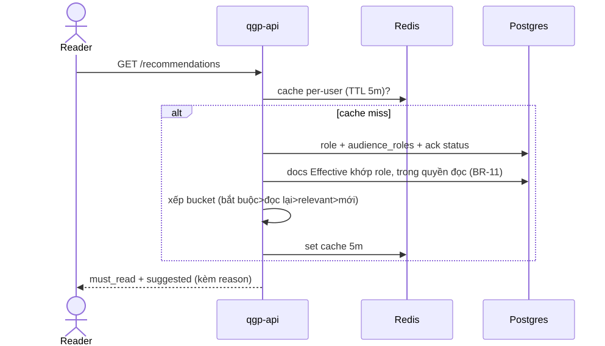

<details><summary>Mermaid source</summary>

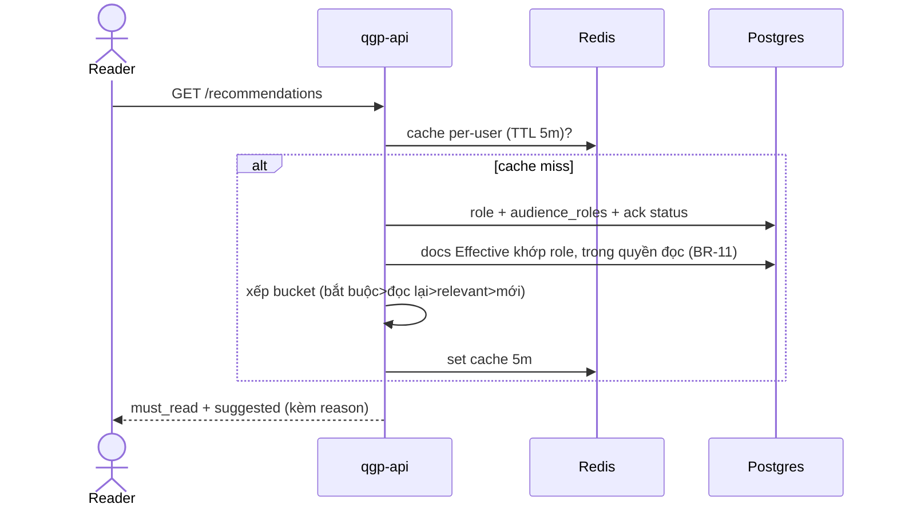
```mermaid
sequenceDiagram
  actor U as Reader
  participant API as qgp-api
  participant R as Redis
  participant DB as Postgres
  U->>API: GET /recommendations
  API->>R: cache per-user (TTL 5m)?
  alt cache miss
    API->>DB: role + audience_roles + ack status
    API->>DB: docs Effective khớp role, trong quyền đọc (BR-11)
    API->>API: xếp bucket (bắt buộc>đọc lại>relevant>mới)
    API->>R: set cache 5m
  end
  API-->>U: must_read + suggested (kèm reason)
```

</details>

### 4.6 Sequence — BOT query có trích nguồn / insufficient (UC-17/18, P3)

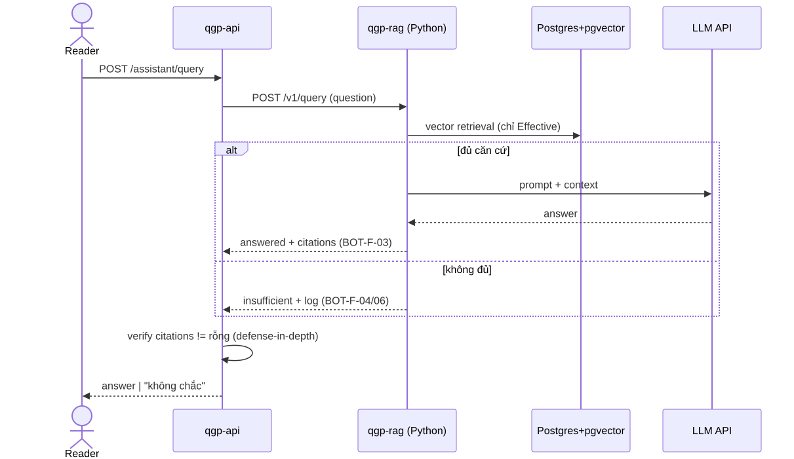

<details><summary>Mermaid source</summary>

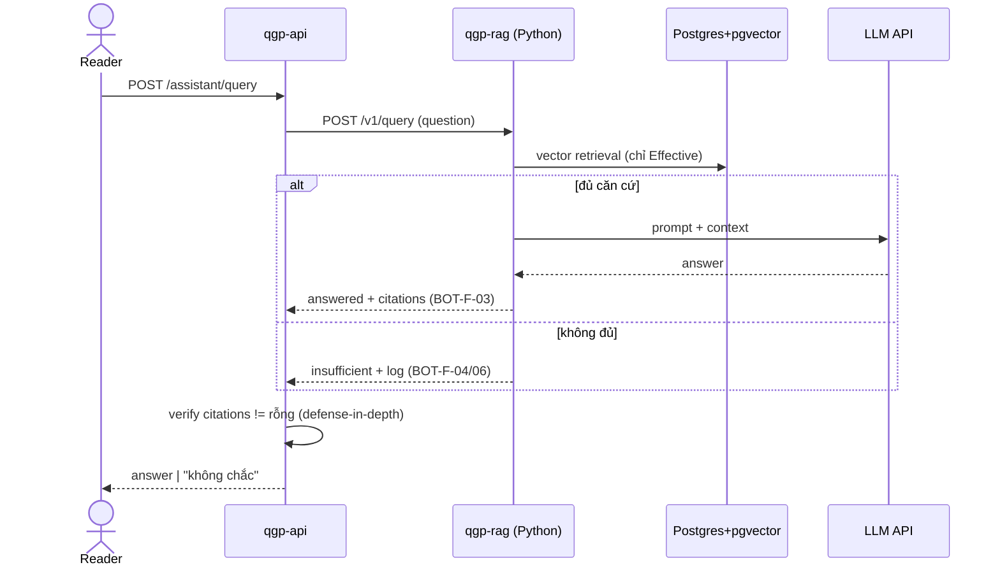
```mermaid
sequenceDiagram
  actor U as Reader
  participant API as qgp-api
  participant RAG as qgp-rag (Python)
  participant DB as Postgres+pgvector
  participant LLM as LLM API
  U->>API: POST /assistant/query
  API->>RAG: POST /v1/query (question)
  RAG->>DB: vector retrieval (chỉ Effective)
  alt đủ căn cứ
    RAG->>LLM: prompt + context
    LLM-->>RAG: answer
    RAG-->>API: answered + citations (BOT-F-03)
  else không đủ
    RAG-->>API: insufficient + log (BOT-F-04/06)
  end
  API->>API: verify citations != rỗng (defense-in-depth)
  API-->>U: answer | "không chắc"
```

</details>

### 4.7 Data flow — nội dung → index & RAG


<details><summary>Mermaid source</summary>

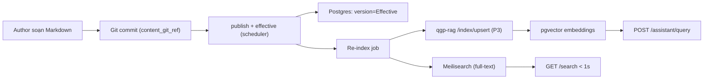
```mermaid
flowchart LR
  ed["Author soạn Markdown"] --> git["Git commit (content_git_ref)"]
  git --> pub["publish + effective (scheduler)"]
  pub --> meta["Postgres: version=Effective"]
  pub --> idxjob["Re-index job"]
  idxjob --> meili["Meilisearch (full-text)"]
  idxjob --> ragup["qgp-rag /index/upsert (P3)"]
  ragup --> vec["pgvector embeddings"]
  meili --> search["GET /search < 1s"]
  vec --> bot["POST /assistant/query"]
```

</details>

---

## 5. Algorithms / Critical Business Logic

### 5.1 Effective transition & supersede (scheduler)
Chạy hằng ngày, **idempotent**, dùng transaction + `SELECT ... FOR UPDATE` để tránh race:

```text
tx:
  candidates = SELECT * FROM document_versions
               WHERE status='Published' AND effective_date <= today FOR UPDATE
  for v in candidates:
     old = SELECT ... WHERE document_id=v.document_id AND status='Effective' FOR UPDATE
     if old: old.status='Superseded'
     v.status='Effective'
     UPDATE documents SET current_effective_version_id=v.id WHERE id=v.document_id
     audit(action='auto_effective', version=v.id)
     enqueue reindex(v)         # Meilisearch + qgp-rag upsert
commit
```
Chốt chặn cuối: `uq_one_effective_per_doc` (partial unique) → nếu logic sai vẫn không thể có 2 Effective.

### 5.2 Recommendation scoring (rules-based, explainable — BR-11)

```text
candidates = Effective ∩ readable(user, RBAC) ∩ audience_roles(user.roles)
for d in candidates:
  if d.mandatory_ack and not acked(user, d.effective_version):
        bucket=MUST_READ; reason="bat buoc"
  elif acked(user, prev_major) and is_new_major(d):
        bucket=MUST_READ; reason="can doc lai"
  else: bucket=SUGGESTED; reason = "khop role" or "vua cap nhat" (nếu updated < 14 ngày)
priority = MUST_READ trước; trong bucket: (mandatory, mới cập nhật) desc
cache per-user 5m; invalidate on {new Effective | major | user ack}
```
Không dùng ML ở P2 → mọi gợi ý giải thích được (reason trả trong API). REC-F-08 (ML, opt-in) để P3.

### 5.3 Version bump (BR-05)
`major (x.0)`: normative → re-approval + reset ack (BR-08). `minor (x.y)`: editorial → owner tự phát hành,
không reset. `change_type` do Author khai báo (POST /versions), Approver xác nhận ở UC-06.

### 5.4 Diff (DOC-F-06)
So sánh nội dung Markdown giữa 2 `content_git_ref` bằng unified diff (git diff / thư viện diff); hiển thị
kèm `change_summary` từng bản.

---

## 6. Security & Privacy

### 6.1 Authentication flow (OIDC)

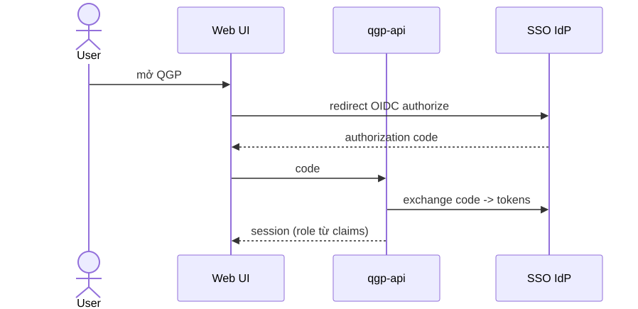

<details><summary>Mermaid source</summary>

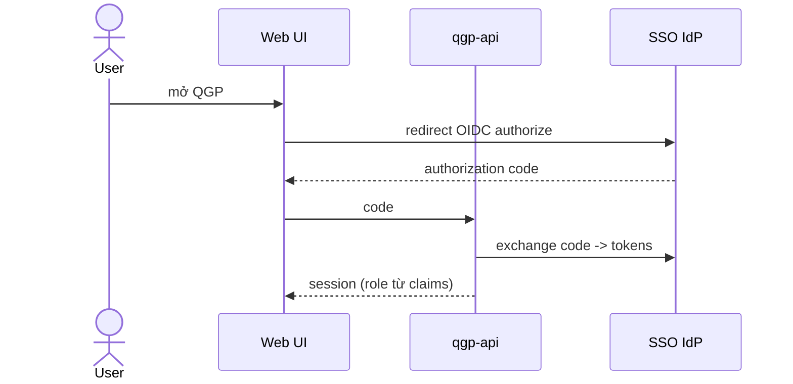
```mermaid
sequenceDiagram
  actor U as User
  participant WEB as Web UI
  participant API as qgp-api
  participant IDP as SSO IdP
  U->>WEB: mở QGP
  WEB->>IDP: redirect OIDC authorize
  IDP-->>WEB: authorization code
  WEB->>API: code
  API->>IDP: exchange code -> tokens
  API-->>WEB: session (role từ claims)
```

</details>

### 6.2 Authorization (RBAC §10.1 PRD)

| Resource / Action | Reader | Contributor | Author | Approver | QA Lead | Admin |
|---|:--:|:--:|:--:|:--:|:--:|:--:|
| Đọc Effective | ✓ | ✓ | ✓ | ✓ | ✓ | ✓ |
| Đóng góp KB | – | ✓ | ✓ | ✓ | ✓ | ✓ |
| Soạn/sửa DOC | – | – | ✓ | ✓ | ✓ | – |
| Duyệt DOC | – | – | – | ✓ | ✓ | – |
| Cấu hình/audit | – | – | – | – | ✓ | ✓ |

Enforce bằng ASP.NET Core policy; mọi kiểm tra ở **server-side** (không tin client).

### 6.3 Threat model (STRIDE)

| Threat | Vector | Mitigation |
|---|---|---|
| Spoofing | Giả danh | OIDC, session ngắn, không auth ngoài SSO |
| Tampering | Sửa bản đã ban hành | Immutable git ref + audit (BR-03, ADM-F-03) |
| Repudiation | Chối thao tác | Audit log ai–gì–khi ≥ 2 năm (NFR-03) |
| Info disclosure | Xem/gợi ý ngoài quyền | RBAC tới cấp tài liệu; REC lọc theo quyền (BR-11) |
| DoS | Spam feedback/search | Rate limit Nginx+API; pagination cap; captcha nội bộ nếu cần |
| Elevation | Vượt quyền duyệt | RBAC theo RACI (ADM-F-06); kiểm tra server-side |
| (RAG) Prompt injection | Nội dung tài liệu độc | Chỉ trích dẫn Effective; không thực thi lệnh; citation bắt buộc (BOT-F-03) |

### 6.4 Input validation
FluentValidation ở API + validate frontmatter ở CI. Frontmatter: `doc_id` regex `^[A-Z]{2,}-[A-Z]{2,}-\d{3,}$`
(immutable), `type` enum, `version` `^\d+\.\d+$`, `effective_date>=issue_date`, `change_summary` 1–500,
`audience_roles` là role hợp lệ. Feedback: `category` enum, `body`≤2000, context server-attached (FBK-F-04).
Render Markdown qua Markdig + HTML sanitizer (chống XSS).

### 6.5 Secrets
Vault (prod): OIDC secret, LLM key, DB creds, Meilisearch/Redis. GitLab masked vars (CI). .NET Secret
Manager (dev). Ưu tiên dynamic DB creds; không commit secret (khớp hook post-write-check). (ADR-0012)

### 6.6 Data classification & privacy

| Dữ liệu | Phân loại | Xử lý |
|---|---|---|
| Nội dung tài liệu | Internal | RBAC, không public |
| Acknowledgement (ai đọc gì) | Personal (nghĩa vụ) | per-user cho compliance; PDPA/NĐ13 |
| Metric truy cập/tra cứu | Aggregate | không per-user (OD-3, BR-10) |
| Audit log | Internal/PII nhẹ | giữ ≥ 2 năm, hạn chế quyền xem |

DPIA nhẹ; per-user chỉ cho acknowledgement (ADR-0003).

---

## 7. Performance & Capacity

### 7.1 Performance budget

| Metric | Target | Đo tại |
|---|---|---|
| Search p95 | < 1 s (Meili mục tiêu < 100 ms) | server-side, corpus vài nghìn tài liệu (NFR-02) |
| API read p95 | < 300 ms | server-side |
| API write p95 | < 800 ms | server-side |
| Page load p95 | < 2 s | mạng nội bộ |
| Availability | ≥ 99% giờ hành chính | NFR-01 |

### 7.2 Capacity plan (giả định — cần QA/PMO confirm)

| Chỉ số | Ước tính |
|---|---|
| Users launch / 12 tháng | 300–500 / +30–50% |
| Peak concurrency | 50–100 |
| API peak | ~50 rps (đọc chủ yếu) |
| Corpus | 2,000–5,000 tài liệu (~50–200 MB) |

Sizing: 1× qgp-api (2 vCPU/4 GB, scale ngang sau Nginx) + Postgres (2/4) + Meili (1/1) + Redis (0.5/0.5).

### 7.3 Caching

| Cache | Key | TTL | Invalidation |
|---|---|---|---|
| Rendered Effective HTML | doc_id+version | 1h | đổi trạng thái / re-index |
| Search phổ biến | query hash | 60s | tự hết hạn |
| Recommendations | user_id | 5m | Effective/major/ack mới |
| Idempotency-Key | key | 24h | tự hết hạn |

### 7.4 Database
Đọc >> ghi; connection pool Npgsql; partition audit theo tháng; index §2.4.

---

## 8. Reliability & Failure Modes

### 8.1 Failure mode analysis

| Failure | Detection | Impact | Mitigation | Recovery |
|---|---|---|---|---|
| Scheduler chết | heartbeat/alert | không tự Effective đúng ngày | job idempotent | re-run; quét lại theo ngày |
| Meilisearch lỗi | health check | tra cứu chậm/lỗi | fallback Postgres FTS | rebuild từ Git+DB (RB-02) |
| Git store down | health check | không đọc/ghi nội dung | cache bản Effective (Redis) | khôi phục remote Git |
| Postgres down | health check | ngừng ghi | replica/HA (tùy hạ tầng) | restore PITR (§8.4) |
| qgp-rag/LLM down (P3) | timeout | BOT không trả lời | kill switch; "không chắc" | retry/backoff |

### 8.2 Retry / timeout (Polly)

| Call | Timeout | Retry | Backoff |
|---|---|---|---|
| qgp-api → Postgres | 5 s | 1 | — |
| qgp-api → Meilisearch | 2 s | 2 | exp |
| qgp-api → qgp-rag /query | 10 s | 0–1 | — + circuit breaker |
| qgp-api → qgp-rag /index | 15 s | 2 | exp |
| SSO introspection | 3 s | 1 | — |

### 8.3 Circuit breaker
Áp cho qgp-rag & Meilisearch (Polly): mở sau N lỗi liên tiếp → fail fast (BOT trả 503/insufficient), half-open thăm dò.

### 8.4 Disaster recovery

| Chỉ số | Mục tiêu |
|---|---|
| RPO | ≤ 24h (backup Postgres hằng ngày + WAL); Git là bản sao nội dung |
| RTO | ≤ 4h (docker-compose up + restore DB + rebuild index) |

Nguồn sự thật nội dung = Git (nhiều bản sao) → mất Postgres vẫn khôi phục được nội dung; metadata restore từ backup.

---

## 9. Observability

### 9.1 Logging
Serilog structured JSON; field chuẩn: `timestamp, level, correlation_id, user_id(hash), action, doc_id,
version, duration_ms`. Sự kiện vòng đời ghi cả audit_log + log.

### 9.2 Metrics (RED + USE)

| Metric | Type | Labels | Dùng để |
|---|---|---|---|
| http_requests_total | counter | route, method, status | RED rate/errors |
| http_request_duration | histogram | route | RED duration (p95) |
| search_latency | histogram | — | NFR-02 |
| scheduler_effective_transitions | counter | result | theo dõi WF-03 |
| rag_query_total | counter | status(answered/insufficient) | BOT citation-rate |
| db_pool_in_use | gauge | — | USE saturation |

### 9.3 Tracing
OpenTelemetry span xuyên Web→api→(rag/db/idx); `X-Request-Id`/traceparent lan sang qgp-rag (ADR-0013).

### 9.4 Alerts

| Alert | Điều kiện | Severity | Hành động |
|---|---|---|---|
| SchedulerStalled | không có transition run > 26h | High | RB-01 |
| SearchSlow | search p95 > 1s (5m) | Med | kiểm Meili |
| HighErrorRate | 5xx > 2% (5m) | High | trực |
| RagCitationMissing | answered mà citations rỗng > 0 | High | tắt BOT (RB-07) |
| PostgresDown | health fail | Critical | on-call |

### 9.5 Product analytics (aggregate — OD-3)

| Event | Trigger | Properties | Đo |
|---|---|---|---|
| doc_viewed | mở tài liệu | doc_id, version, role | RPT-F-03 |
| doc_acknowledged | xác nhận đọc | version_id | RPT-F-04 |
| feedback_submitted | gửi feedback | category | RPT-F-05 |
| search_performed | tìm kiếm | query_hash | RPT-F-03 |
| recommendation_shown | mở panel | buckets, count | REC hiệu quả |

---

## 10. Testing & Verification

### 10.1 Test pyramid

| Level | Scope | Coverage mục tiêu | Owner |
|---|---|---|---|
| Unit | state machine, version bump, recommendation scoring, validators | logic BR-01..11, ≥ 80% | Dev |
| Integration | API+DB+partial-unique (BR-02), scheduler (Testcontainers) | UC-01..24 | Dev/QC |
| Contract | openapi.yaml ↔ controller; qgp-rag contract | schema drift = 0 | Dev |
| E2E | publish→Effective, ack reset major, feedback, recommendation, BOT | AC-* | QC |
| NFR | search<1s, RBAC ngoài quyền, audit retention | NFR-02/03/04 | QC/SRE |

### 10.2 Traceability test
Mỗi **AC** (PRD §9.2) → `TC-*`; ma trận PRD §10.1 là nguồn. Ví dụ AC-DOC-06 (auto-effective) → TC-DOC-06
(integration test scheduler + assert đúng 1 Effective).

### 10.3 Test data
Corpus mẫu (10–20 tài liệu đủ trạng thái), user mỗi role, tài liệu mandatory_ack để test reset. Không dùng dữ liệu thật có PII.

---

## 11. Deployment & Rollout

### 11.1 Rollout stages

| Stage | Audience | Entry | Exit |
|---|---|---|---|
| Dev | team | build pass | unit/integration xanh |
| Staging | QA + pilot | E2E pass, corpus mẫu | UAT đạt, NFR đo được |
| Prod P1 | toàn tổ chức | corpus P1 migrate (A1) | G1 tiến triển |

### 11.2 CI/CD pipeline (GitLab CI)



<details><summary>Mermaid source</summary>

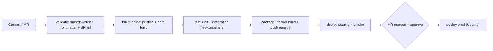
```mermaid
flowchart LR
  commit["Commit / MR"] --> validate["validate: markdownlint + frontmatter + BR lint"]
  validate --> build["build: dotnet publish + npm build"]
  build --> test["test: unit + integration (Testcontainers)"]
  test --> pkg["package: docker build + push registry"]
  pkg --> stg["deploy staging + smoke"]
  stg --> approve{"MR merged + approve"}
  approve --> prod["deploy prod (Ubuntu)"]
```

</details>

MR theo `01_MR_Compliance` (Conventional Commits, tag [AI]).

### 11.3 Feature flags & kill switch
Config: `feature.rec`, `feature.bot`, `bot.killSwitch`. P1 mặc định REC/BOT off.

### 11.4 Data migration & backfill
Script idempotent per tài liệu: inventory → convert Markdown+frontmatter → assign doc_id/version/status/
effective/classification/audience_roles → commit Git + seed DB → build index → verify BR-02 & links. (A1 PRD)

---

## 12. Backward Compatibility & Deprecation

| Surface | Old | New | Compat | Deprecation |
|---|---|---|---|---|
| REST API | – | /v1 | path version + Sunset | khi có /v2 |
| Doc format | Excel/HTML rời rạc | Markdown + frontmatter | import 1 chiều, giữ bản gốc | sau migrate P1 |
| qgp-rag contract | – | v0.1 | version cùng OpenAPI | breaking → parallel run |

---

## 13. Operations & Runbook

- **RB-01** Chạy lại scheduler job (idempotent) — endpoint admin / CLI; kiểm audit `auto_effective`.
- **RB-02** Rebuild Meilisearch index từ Git+DB.
- **RB-03** Kiểm invariant BR-02: `SELECT document_id,count(*) FROM document_versions WHERE status='Effective' GROUP BY 1 HAVING count(*)>1` (phải rỗng).
- **RB-04** Rotate secrets (Vault) → rolling restart → verify `/healthz`.
- **RB-05** Khôi phục: Git (clone remote) · Postgres (PITR) · Meili (RB-02) · Redis (warm lại).
- **RB-06** Tài liệu quá hạn review (UC-11)/retire (UC-12).
- **RB-07** Kill switch BOT: `bot.killSwitch=true` → `/v1/assistant/*` trả 503.

Runbook on-call/escalation hoàn thiện trước GA (bắt buộc theo PRD Appendix).

---

## 14. Alternatives Considered

- **A. Confluence/SharePoint (O2)** — yếu Approved≠Effective, lock-in → loại (ADR-0001).
- **B. Custom/static-only (O3 & MkDocs)** — static không làm được RBAC/workflow per-user → chọn docs-as-code + web app động.
- **Build vs buy**: build-lean docs-as-code (O1) — Git versioning, Markdown export, corpus structured cho BOT.
- **Stack**: .NET core + RAG Python (ADR-0006/0007); Meilisearch vs Postgres FTS (ADR-0009); pgvector vs vector DB riêng (ADR-0008).

---

## 15. Glossary

| Term | Meaning |
|---|---|
| Effective / Approved | Đang hiệu lực / đã duyệt nhưng có thể chưa tới ngày áp dụng (BR-07) |
| Superseded / Retired | Bị thay thế / hết vòng lưu trữ |
| docs-as-code | Quản lý tài liệu như mã nguồn (Git + render động) |
| RAG | Retrieval-Augmented Generation (BOT trả lời + trích nguồn) |
| RBAC | Role-Based Access Control |
| audience_roles | Vai trò áp dụng của tài liệu (nguồn REC) |
| pgvector | Extension Postgres cho vector embeddings |
| RPO/RTO | Recovery Point/Time Objective |
| BR-xx | Business Rule (PRD §10.2) |

---

## 16. Design Sign-off

| Vai trò | Xác nhận | Bắt buộc khi |
|---|---|---|
| SA (DRI) | Thiết kế khả thi, map đúng PRD | Luôn |
| TL | Khả thi hiện thực | Luôn |
| DevOps/SRE | Hạ tầng, CI, observability, DR | Trước GA |
| CSOC | Security/STRIDE/privacy | Có PII/regulatory |
| DBA | Data model, index, retention | Có schema/migration |

---

## 17. Appendix

- PRD: `product-spec/PRD_QGP_v1.0.docx`
- ADR: `product-spec/adr/` (ADR-0001..0013)
- API: `product-spec/api/openapi.yaml`, `qgp-rag.openapi.yaml`, `rag-integration-contract.md`
- Skeleton code: `product-spec/generated/` (qgp-api-server, qgp-rag-client)
- Internal Standards: `docs/ai/internal_rules/` (Microservice/API Naming, Response&Error, Timeout, MR, Coding)

---

## 18. Phân công RACI theo mục (SDD)

| Mục SDD | BA | SA | PM | TL | Phê duyệt (A) | Hỗ trợ |
|---|:--:|:--:|:--:|:--:|:--:|---|
| Architecture / Data / API / Flows | C | R | I | C | SA Lead/PO | DBA (C) |
| Security & Privacy | C | R | I | C | SA Lead/PO | CSOC (R) |
| Performance / Reliability / Observability | I | R | I | C | SA Lead/PO | DevOps (R) |
| Deployment / Rollout / Runbook | I | R | C | R | SA Lead/PO | DevOps (R) |
| Alternatives / Sign-off | C | R | C | C | SA Lead/PO | – |

---

*SDD-QGP-001 v1.0 · map từ PRD v1.0 + ADR-0001..0013 · Markdown + Mermaid (ảnh render sẵn) · Nội bộ FPT ISC*
