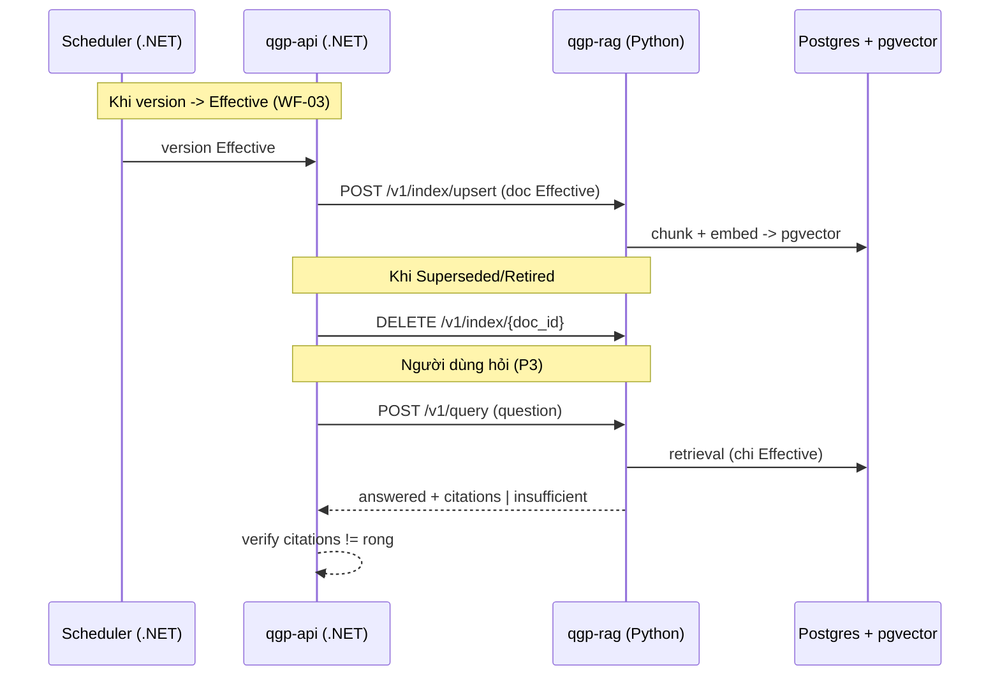

# Integration Contract — qgp-api (.NET) ↔ qgp-rag (Python)

> Bổ trợ cho `qgp-rag.openapi.yaml`. Định nghĩa trách nhiệm, xác thực, timeout, và bất biến governance
> giữa core backend .NET và RAG service Python (ADR-0007, P3).

## 1. Trách nhiệm (ai làm gì)

| Việc | qgp-api (.NET) | qgp-rag (Python) |
|---|:--:|:--:|
| Quyết định tài liệu nào Effective / được index | ✅ (nguồn sự thật) | – |
| Gọi `/index/upsert` khi version → Effective (WF-03) | ✅ | nhận & embed |
| Gọi `/index/{doc_id}` DELETE khi Superseded/Retired | ✅ | gỡ chunk |
| Chunk + embedding + lưu pgvector | – | ✅ |
| Retrieval + sinh câu trả lời + citation | – | ✅ |
| Enforce "chỉ Effective" (BR-06/OD-4) | ✅ (chỉ gửi Effective) | tin input |
| Enforce "không citation → không trả lời" (BOT-F-03/04) | kiểm tra lại response | ✅ (tạo) |
| Kill switch / feature flag BOT | ✅ (§11.3) | – |
| Proxy request người dùng → RAG | ✅ (`/v1/assistant/query`) | – |

## 2. Xác thực & mạng
- Service-to-service: **Bearer service token** (client credentials) do qgp-api trình; **mạng nội bộ**,
  khuyến nghị **mTLS**. qgp-rag KHÔNG expose public, KHÔNG nhận token người dùng cuối.
- `X-Request-Id` truyền xuyên suốt để correlate trace (OpenTelemetry — ADR-0013).

## 3. Timeout, retry, circuit breaker (map SDD §8)
| Call | Timeout | Retry | Ghi chú |
|---|---|---|---|
| `POST /query` | 10 s | 0–1 (idempotent GET-like) | LLM chậm; dùng Polly + circuit breaker ở qgp-api |
| `POST /index/upsert` | 15 s | 2 (backoff) | idempotent theo doc_id |
| `DELETE /index/{doc_id}` | 10 s | 2 | idempotent |
| `POST /reindex` | async | – | 202 + chạy nền |

- **qgp-rag down / timeout** → qgp-api trả `503` cho `/v1/assistant/*` và hiển thị thông điệp "trợ lý tạm
  không sẵn sàng" (không chặn DOC/KB). Tương đương kill switch.

## 4. Bất biến governance (contract phải giữ)
1. qgp-api **chỉ** gửi nội dung **Effective** vào `upsert` → đảm bảo BR-06 / OD-4 ngay từ nguồn.
2. `upsert` **idempotent theo `doc_id`** — thay thế toàn bộ chunk cũ → phản ánh đúng 1 bản Effective (BR-02).
3. qgp-rag trả `status=answered` **chỉ khi** có ≥ 1 citation hợp lệ; ngược lại `insufficient` (BOT-F-03/04).
4. qgp-api **kiểm tra lại**: nếu `answered` mà `citations` rỗng → coi như lỗi, không hiển thị (defense-in-depth).
5. Mỗi `insufficient` được qgp-rag log (BOT-F-06) để QA bổ sung KB/FAQ.

## 5. Luồng tích hợp

## 6. Versioning contract
- Contract versioned cùng `qgp-rag.openapi.yaml` (`info.version`). Breaking change → bump + parallel run.
- qgp-api pin phiên bản contract; thay đổi payload phải cập nhật cả hai phía + test integration.

## 7. Liên quan
- Contract máy đọc: `qgp-rag.openapi.yaml`
- Public API: `openapi.yaml` (`/v1/assistant/query`)
- Quyết định: ADR-0007 (RAG Python), ADR-0004 (corpus Effective+FAQ), ADR-0008 (pgvector), ADR-0013 (OTel)
- SDD: §1.2, §4.4, §8
